# CHyF Conceptual Model,  Version 1.0

**Natural Resources Canada (NRCan)**,
**Canada Centre for Mapping and Earth Observation (CCMEO)**

Date: 2019 June 30

Copyright and Licence Notice

- Copyright © 2019 Government of Canada
- This document falls under the [Open Government Licence - Canada, Version 2.0](https://open.canada.ca/en/open-government-licence-canada)

Authorship

- NRCan/CCMEO
  - [mark.sondheim@canada.ca](mailto:mark.sondheim@canada.ca)

This document is the first in the [CHyF documentation series](./index.md#CHyF-documentation-series):

- Volume 1: **CHyF Conceptual Model**

- Volume 2: [CHyF Compliant Source Data Hydrography and DEM Specification](./chyfCompliantSourceHydrographyAndDEMSpecification.md)

- Volume 3: [CHyF Data for CHyF Services Specification](./chyfDataForCHyFServicesSpecification.md)

- Volume 4: [Data Processing and Validation Tools](./chyfDataProcessingAndValidationTools.md)

- Volume 5: [Web Services and Applications](./chyfWebServicesAndApplications.md)

## Abstract

In 2018 the Open Geospatial Consortium released, “OGC® WaterML 2: Part 3
\- Surface Hydrology Features (HY\_Features) - Conceptual Model”. The
Common Hydrology Features (CHyF) model extends HY\_Features and makes
some minor changes to it required for implementation and the delivery of
high performance services. HY\_Features defines hydrologic features
without regard to their representation or scale. CHyF is also suitable
at any scale and with various representations; however, model
differences do result because of different geometric representations.
HY\_Features discusses spatial coverage and topological relations. In
CHyF these are key ideas, as is the notion that hydrologically defined
network components form elements of a mathematical graph, allowing for
very fast network traversal.

HY\_Features defines catchments and catchment networks, as well as
rivers, channels, flowpaths and hydrographic networks. CHyF follows
suit, but adds more detail, as required to implement topological and
graph relations. This starts with the definition of elementary
catchments and elementary flowpaths, which are treated as fundamental
elements roughly similar to their counterparts in the traditional
reach-catchment model. If they are subdivided, the result is simply more
elementary catchments and elementary flowpaths. Consequently, they are
the building blocks used to form complementary coverages as well as a
graph structure referred to as a hygraph. Building the hygraph
necessitates that connections between features be manifest through their
geometry. Divergences and distributaries are supported in CHyF, as the
hygraph need not be hierarchical. Nevertheless, CHyF does recognize
large drainages that are hierarchical in nature and of value to
management functions.

Different kinds of elementary catchments and elementary flowpaths are
defined in CHyF. Of note is that polygonal waterbody features, or
portions of such features, are treated as elementary catchments in their
own right. In addition to these water catchments, several kinds of
land-based elementary catchments are recognized. These model constructs
are compatible with the higher level conceptual model in HY\_Features,
although they differ in detail from other popular implementation models.
With the approach taken it becomes practical to handle very large lakes
and rivers, as well as coastal ocean zones. CHyF also includes wetlands,
glaciers and snowfields as kinds of hydro features, although they are
out of scope of HY\_Features.

HY\_Features describes, but does not require, a river reference system
based on linear referencing to define locations of hydrologic interest
along a river. With CHyF, location defined through GPS coordinates is
sufficient. CHyF’s implementation does not make use of linear
referencing or an associated coding scheme. The underlying CHyF model
does not depend on meaningful, immutable references that must be
maintained. CHyF emphasizes not only data but also services that can be
initiated from arbitrary geographic positions; examples of such services
include catchment area services, downstream and upstream services, and
pour point services. Descriptions of these services are found in volume
5 of this series.

## Keywords

The following are keywords to be used by search engines and document
catalogues.

CHyF; HY\_Features implementation; implementation specification;
hydrologic features model; hydrologic services; hydrographic features.

## Preface

The CHyF (pronounced *chief*) model is derived from HY\_Features and is
an implementation of it, with some differences introduced for
operational reasons. It also borrows directly from hydrologic and
topologic concepts, and from graph theory. It defines a geospatial data
specification directly amenable to the development of open hydrologic
services accessible over the World Wide Web. However, it is fully
suitable for use on traditionally architected projects, where the web is
not a factor. In either case CHyF is designed to be performant and
scalable.

CHyF impacts data management in several way. It significantly reduces
the amount of work that must be undertaken to maintain a database for a
given area or for an entire continent. The general level of complexity
of the data model is much less than that of some alternatives. Local
adjustments to the data are not required to meet specific model
limitations, such as the requirement by some coding systems for
dendritic structures. Updates can be handled comparatively easily
without the need to continuously support and conflate large numbers of
feature identifiers.

The power of CHyF comes about because of its use of a mathematical
graph, referred to here as a hygraph. This graph is similar in intent
and design to graphs built for navigation through road networks. It is
specialized in that it is tailored for hydrologically related networks
composed of elementary catchments and flowpaths. Hygraph operations and
related geospatial functions are so fast that computation can replace
more complex data structures.

## Scope

This document describes the CHyF conceptual model. It is intended to
meet the needs of hydrologists and environmental professionals concerned
with hydrologic assessments or the health of watersheds and river
systems. CHyF pertains to the description and behaviour of hydrologic
features found on the surface of the earth. Groundwater and atmospheric
phenomena are out of scope, but some approaches to interfacing are
discussed.

Familiarity with HY\_Features is helpful, but not mandatory. The model
presented in HY\_Features is similar in many respects to that used as
the basis of the United States NHD (National Hydrographic Dataset) and
its offshoots, the NHDPlus and the NHDPlus HR (High Resolution). So
knowledge of any of these and their related developments (e.g.,
StreamStats) is also relevant, but again not necessary.

The structure of the document is similar to that of many Open Geospatial
Consortium (OGC) publications, with changes made to accommodate the
specific content. In all cases where relevant, the relationship to
HY\_Features is noted. In some cases, the relationship to the NHD suite
of standards is also indicated. This is done to help foster semantic
interoperability, and where differences exist, to help clarify why they
do. Thus, reference is also made to the terminology found in the
WMO/UNESCO "International Glossary of Hydrology".

## Conformance

CHyF conforms to the HY\_Features conceptual model, with some exceptions
as noted above. Appendix 1 clarifies the relationship through provision
of a CHyF ‒ HY\_Features Crosswalk. Similar mappings are also included
in Appendix 2 to Canada’s National Hydro Network (NHN) and the NHDPlus
model of the United States.

CHyF also conforms to a number of existing OGC and ISO standards, as
listed in section 3 below. In particular, geometric representations
follow the Simple Feature Access (ISO 19125) model and the specification
in general aligns with the SQL/MM Spatial (ISO/IEC 13249-3)
specification.

Because CHyF conforms with the standards and specifications noted above,
popular open source and commercial geospatial software can work directly
with CHyF compliant data, available in GeoJSON and GeoPackage formats.

CHyF also provides web services that follow a RESTful design, making use
of HTML and GeoJSON. They are architected in line with common practice
on the Web, and thus are in support of general interoperability.
Currently, they are specified independently of OGC Web Services. In the
future this may change as the OGC moves toward REST.

Formal modeling is expressed through UML diagrams, in line with OGC
practices. However, for clarity, simple logic diagrams are used in the
section on Terms and Definitions. These diagrams are similar to class
and subclass definitions in UML but are more accessible to a broader
audience.

## References

This document contains references to the following:

A Land Use And Land Cover Classification System For Use With Remote
Sensor Data;

by James R. Anderson, Ernest E. Hardy, John T. Roach, and Richard E.
Witmer;

Geological Survey Professional Paper 964, United States Geological
Survey

([http://www.pbcgis.com/data\_basics/anderson.pdf](http://www.pbcgis.com/data_basics/anderson.pdf))

Australian Hydrological Geospatial Fabric (Geofabric)  
([http://www.bom.gov.au/water/geofabric/index.shtml](http://www.bom.gov.au/water/geofabric/index.shtml))

Coastal Wiki, Definitions of coastal terms; Coastal Wiki  
([http://www.coastalwiki.org/wiki/Definitions\_of\_coastal\_terms](http://www.coastalwiki.org/wiki/Definitions_of_coastal_terms))

DE-9IM (Dimensionally Extended nine-Intersection Model)  
([https://en.wikipedia.org/wiki/DE-9IM](https://en.wikipedia.org/wiki/DE-9IM))

Ice, Snow, and Glaciers: The Water Cycle. United States Geological
Service. (USGS)  
([https://water.usgs.gov/edu/watercycleice.html](https://water.usgs.gov/edu/watercycleice.html))

International Glossary of Hydrology / Glossaire International
d’Hydrologie. World Meteorological Organization, United Nations
Educational, Scientific and Cultural Organization (eds.). WMO (Series),
no385. WMO, Geneva (2016). ISBN 978-92-63-03385-8. ISBN
978-92-3-001154-3  
([https://hydrologie.org/glu/HINDEN.HTM](https://hydrologie.org/glu/HINDEN.HTM))

OGC Abstract Specifications  
([http://www.opengeospatial.org/docs/as](http://www.opengeospatial.org/docs/as))

OGC® WaterML 2: Part 3 - Surface Hydrology Features (HY\_Features) -
Conceptual Model  
([http://docs.opengeospatial.org/is/14-111r6/14-111r6.html](http://docs.opengeospatial.org/is/14-111r6/14-111r6.html))

Oxford Dictionaries  
([https://en.oxforddictionaries.com/](https://en.oxforddictionaries.com/))

Principles of Design and Operations of Wastewater Treatment Pond Systems
for Plant Operators, Engineers, and Managers; 2011; U.S. Environmental
Protection Agency  
([https://www.epa.gov/sites/production/files/2014-09/documents/lagoon-pond-treatment-2011.pdf](https://www.epa.gov/sites/production/files/2014-09/documents/lagoon-pond-treatment-2011.pdf))

The Ramsar Convention Manual, 6th edition; 2013; Ramsar Convention
Secretariat  
([https://www.ramsar.org/sites/default/files/documents/library/manual6-2013-e.pdf](https://www.ramsar.org/sites/default/files/documents/library/manual6-2013-e.pdf))

What is a wetland? 2017; U.S. Environmental Protection Agency  
([https://www.epa.gov/wetlands/what-wetland](https://www.epa.gov/wetlands/what-wetland))

Wikipedia  
([https://en.wikipedia.org/wiki/Main_Page](https://en.wikipedia.org/wiki/Main_Page))

WordNet Search; Princeton University  
([https://wordnet.princeton.edu/](https://wordnet.princeton.edu/))

## Terms and Definitions

The following modelling terms and definitions are used in this document.
To ease understanding, they are provided within groups that correspond
to the primary entities within the CHyF model. These high level concepts
are taken primarily from HY\_Features; however, other sources besides
HY\_Features are references as well. In a number of cases new terms are
introduced to aid the objectives of CHyF as a graph compatible
implementation model.

To aid understanding, for each of the high level concepts, a simple
logic chart is shown, depicting the further breakdown of the concept.
This begins with CHyF as a domain, with the major types of objects
encompassed by CHyF shown on the right in the figure below. In
subsequent chapters the CHyF model is fully explained and UML diagrams
are provided. These figures should not be interpreted as equivalent to
UML class diagrams; in some cases they do correspond to class – subclass
relationships, but in other cases they do
not.

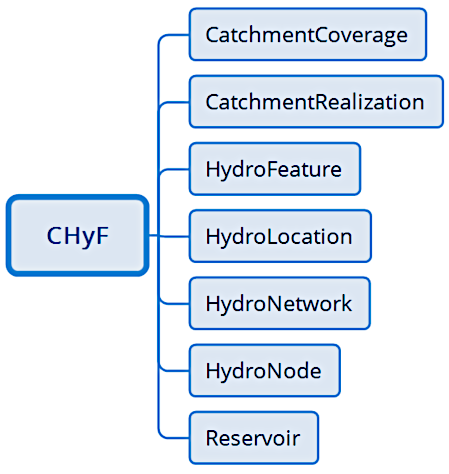

### Catchment Coverage

A geospatial coverage is formed from a set of catchments, with no gaps
and no overlaps, within the area of interest. All elementary catchments
within the area form a coverage. However, a coverage may be defined from
larger catchments, with each of these defined recursively from smaller
catchments, ultimately ending with a set of elementary catchments. Both
HY\_Features and CHyF recognize coverages, although in HY\_Features it
is not part of the formal model. In CHyF it is a key concept directly
relevant to some of the CHyF services.

### Catchment Realization

In HY\_Features and CHyF a general notion exists of catchment
realization. In CHyF a catchment may be realized by: (i), a catchment
divide, a boundary or portion of a boundary of a catchment, or (ii), a
flowpath, representing the idealized drainage of water from a catchment.

#### Catchment Divide

A catchment divide forms all or a portion of the boundary of a
catchment. It is a one-dimensional (linear) feature. \[after HY\_F\] It
is derived from the geometry of the waterbodies and an elevation model
that may be based on a point cloud or a gridded dataset. A catchment
divide may be instantiated as a single linestring or a series of
connected linestrings.

##### Catchment Divide Segment

A portion of a catchment divide, represented by a linestring, that forms
an edge between nodes, in a mesh consisting of all catchment boundaries.

#### Flowpath

A derived linear feature that realizes a catchment specifically as a
path connecting the inflow or headwater start point with the outflow of
the catchment. \[after HY\_F\] A flowpath may be designated as either
primary or secondary. A flowpath may be instantiated as a single,
directed linestring or a series of connected, directed linestrings. The
direction of a flowpath is always downstream.

##### Elementary Flowpath

A flowpath terminated at either end by a hydro node, such as a
confluence point, a headwater start point, a terminal point where a
river empties into a lake or the ocean, or the place on a flowpath where
the data is terminated.

###### Bank Flowpath

A flowpath that connects a bank catchment to other skeletal elements
(inferred flowpaths) in a waterbody with polygonal geometry. It is
otherwise similar to an inferred flowpath.

###### Constructed Flowpath

A flowpath that appears to traverse the land but was not visible when
mapped. Flowpaths through dams or through heavily forested terrain are
examples.

###### Inferred Flowpath

A flowpath that exists as a skeletal element in a waterbody with
polygonal geometry. It is similar to a bank flowpath, but does not
connect to a bank catchment.

###### Observed Flowpath

A flowpath corresponding to a section of a river with linear geometry.

##### Main Flowpath

A linear feature defined as a series of connected flowpaths, upstream
from a hydro nexus to a unary nexus at a headwater source. It realizes a
catchment based on stream name, longest length, largest area, or
estimated flow volume. Another name for *main flowpath* is *mainstem*.

### Hydro Feature

“Feature of a type defined in the hydrology domain, whose identity can
be maintained and tracked through a processing chain from measurement to
distribution of hydrologic information.” \[HY\_F\] This is a high level
construct that includes waterbodies, catchments, and other
hydrologically related features.

Ice Snow, Nearshore Zone, and Wetland are not included in HY\_Features ,
but are in CHyF for reasons of semantic completeness and user
requirements.

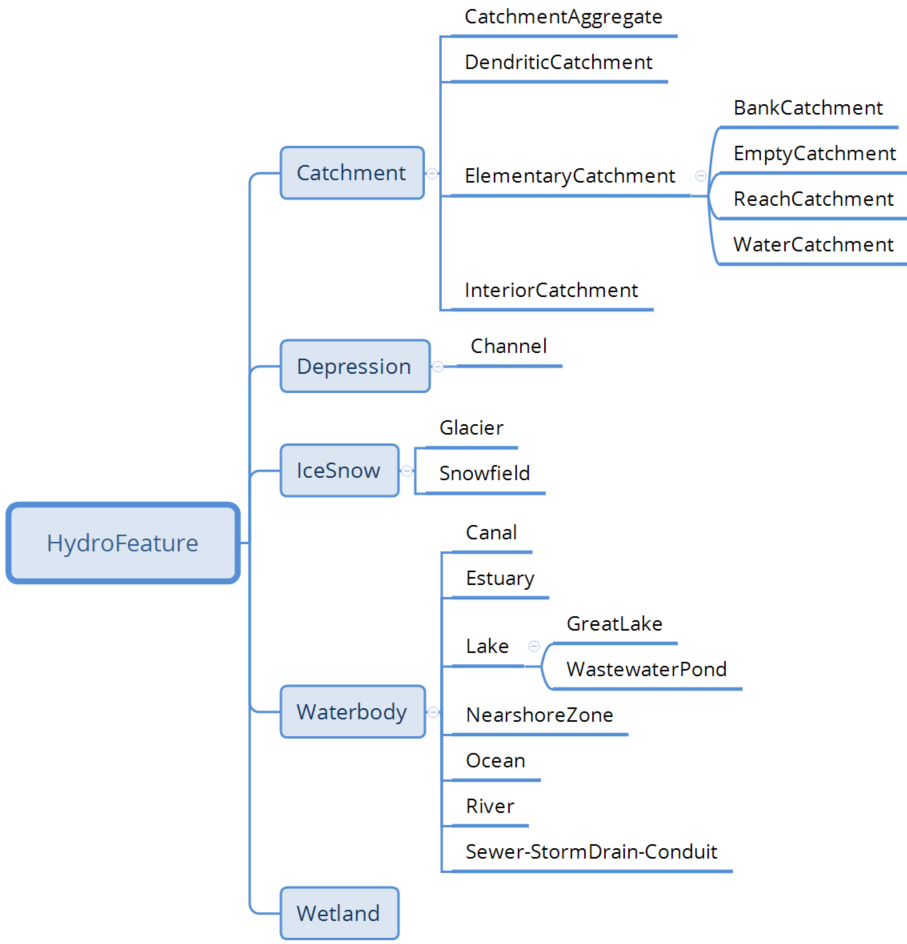

#### Catchment

“A physiographic unit where hydrologic processes take place. This class
denotes a physiographic unit, which is defined by a hydrologically
determined outlet to which all waters flow. …” \[HY\_F\] As used in
HY\_Features and CHyF, a catchment may consist of the entire area that
drains to an outlet, or of a smaller, contained portion that drains to
the same or another outlet. They both also support the notion of an
interior catchment, which drains internally.

The terms watershed, basin, catchment and drainage area are effectively
synonyms, but only catchment is used as part of the formal model in CHyF
and HY\_Features. Catchments may have nested, hierarchical
relationships; in western Canada and the US, the Similkameen River
Watershed is contained in the Okanagan River Watershed, which in turn is
contained in the Columbia River Watershed. They may also be defined as
non-overlapping drainage areas within a larger basin. In the eastern US
the Susquehanna River Basin is composed of six non-overlapping
subbasins: the Upper Susquehanna, the Chemung, the Middle Susquehanna,
the West Branch Susquehanna, the Juniata and the Lower Susquehanna.

CHyF allows for a strict definition of a catchment, in which case
interior catchments are excluded and all areas explicitly drain to a
common outlet; it also allows for a looser definition in which all fully
contained interior catchments are included in the definition of the
large catchments. The Richelieu River Watershed in Quebec for example
contains nearly 300 lakes that are not connected to nearby rivers
through the mapped surface water network. Each of these lakes and its
surrounding area constitutes an interior catchment. Depending upon the
application, it may or may not be of interest to include those areas in
the Richelieu catchment.

##### Catchment Aggregate

A catchment type defined “... as a set of non-overlapping dendritic and
interior catchments arranged in an encompassing catchment.” \[HY\_F\] It
is not a general term for an aggregation of adjacent catchments. Instead
it is intended to describe hierarchical systems based on dendritic
catchments; it may also contain interior catchments.

A catchment aggregate is typically named, as it acts as an identifiable
area of significance in the context of interoperability among agencies.
It this context it may also be considered as *contracted*, equivalent to
a contracted nexus in intent.

##### Dendritic Catchment

“Catchment in which all waters flow to a single common outlet. A
dendritic catchment is permanently connected to others in a dendritic
(tree) network …” \[HY\_F\] If secondary flows around islands or across
deltas exist, then the catchment may still be considered as dendritic,
so long as the primary flows are identified and so long as they form a
dendritic pattern.

##### Elementary Catchment

A catchment defining a fundamental subdivision of the landscape in which
water can be modelled as draining to a single outlet, to an adjacent
waterbody, or internally to an area devoid of waterbody features. An
elementary catchment is bounded by other elementary catchments; that is,
elementary catchments compose a complete coverage. Four types of
elementary catchments are recognized: reach catchments, bank catchments,
empty catchments, and water catchments. An elementary catchment is
generally equivalent to a reach catchment in the US NHDPlus.

###### Bank Catchment

An elementary catchment consisting of land that drains to a section of a
river represented geometrically as a polygon in 2D. It does not contain
a waterbody, although it is adjacent to one. For example, if two streams
drain into a lake, the remnant area between the catchments for the two
streams also drains into the lake; it defines a bank catchment.

###### Empty Catchment

An elementary catchment consisting of internally drained land that does
not touch a waterbody. In 2D the ring defining its boundary does not
surround any waterbodies.

###### Reach Catchment

An elementary catchment consisting of land that drains to a section of a
river represented geometrically as a linear element in 2D. The river
feature is contained in the catchment.

###### Water Catchment

An elementary catchment consisting entirely of a waterbody of a portion
of a waterbody, where the geometry of the feature is a polygon in 2D. A
single small lake may be geometrically equivalent to a water catchment.
A larger lake or a river sufficiently large to have polygonal geometry
may be broken into a series of areas, each defined as a water catchment.

A water catchment participates in a catchment network, whereas a
waterbody with areal extent participates in a hydrographic network. The
attributes of a water catchment differ from those of a waterbody with
areal extent. Water catchments are represented directly in a hygraph
data structure, whereas waterbodies are not.

##### Interior Catchment

A “... feature type that specializes the general ... \[catchment\] class
as a catchment that is generally not connected to other catchments.”
\[HY\_F\] An interior catchment consists of one or more elementary
catchments that collectively define a basin with no flowpath connections
on the surface to flowpaths outside of the catchment.

#### Depression

“Landform lower than the surrounding land and partially or completely
closed that is able to but does not necessarily contain water.”
\[HY\_F\] Waterbodies exist within depressions. Some depressions though
do not contain waterbodies, either because the waterbody is ephemeral
and not present at the time of mapping or because the soil or substrate
is so porous that a waterbody never forms.

##### Channel

“Natural or artificial waterway, clearly distinguished, which
periodically or continuously contains moving water, or which forms a
connecting link between two bodies of water.” \[HY\_F\] Channels are
depressions that form the containers for rivers, but water may be
present in a channel only during heavy rains or large floods.

#### IceSnow

Perennial cover of either ice or snow. \[after Anderson\]

##### Glacier

Accumulation of ice with an atmospheric origin which usually moves
slowly on land over a long period. \[WMO\]

##### Snowfield

“Perennial Snowfields are accumulations of snow and firn that did not
entirely melt during previous summers. Snowfields can be quite extensive
... or can be quite isolated and localized …” \[Anderson\]

#### Waterbody

“Mass of water distinct from other masses of water.” \[HY\_F\] The term
refers to lakes, rivers and other watercourses of any size, which may be
permanent or ephemeral.

The geometry of a waterbody may be one-dimensional, with 2D or 3D
coordinates, or it may be two-dimensional with 2D or 3D coordinates, and
in either case if 3D coordinates are used the third coordinate refers to
the elevation of the surface. Bathymetric data may be available
separately.

##### Canal

A body of surface water, participating in a hydrographic network,
special due to its artificial origin (man-made) and its permanent or
temporary flow. Artificial waterway for navigation and for the transport
of water are canals. Ditches and drainage channels that typically
contain water are also included. \[after HY\_F, Oxford, Ramsar\]

##### Estuary

“... a body of surface water, participating in a hydrographic network,
made special due to branching and its interaction with the open sea.”
\[HY\_F\] Estuaries are characterized by tidal waters and are often
associated with deltas.

##### Lake

A body of surface water, participating in a hydrographic network; it is
special due to its considerable size and the lack of significant
observable flow except at inflows and outflows. A lake may or may not be
anthropogenic in origin and may or may not be regulated. \[after HY\_F
and Anderson\] It usually contains freshwater, but may also contain salt
water, as with the Dead Sea, Lake Assal and the Great Salt Lake.

###### Great Lake

One of the Laurentian Great Lakes of North America or other very large
lakes. They are conceptualized as a specialization of the general notion
of a lake, with potentially specific associated methods and attributes
that may for example be derived from ocean models.

###### Wastewater Pond

A pond or lagoon designed to contain wastewater for treatment. \[after
EPA-2011\]

##### Nearshore Zone

The zone extending from the edge of an ocean or a large lake or a large
river or a large estuary, where the edge is defined as the limit of land
as found on topographic mapping, to an arbitrary distance that may be
related by bathymetry, littoral characteristics including wave activity,
coastal currents, or a buffer zone of a given dimension. A river
emptying into the ocean or a large lake may be said to be emptying into
the nearshore zone. In the context of an ocean, the following definition
applies: “The zone extending seaward from the low water line well beyond
the surf zone; it defines the area influenced by the nearshore or
longshore currents. ...” \[Coastal Wiki\]

##### Ocean

A large body of saline water that composes much of the earth’s
hydrosphere and that is not situated inland. \[After Wikipedia and
Princeton\] Seas and bays that extend to the open ocean are classed as
ocean. The Caribbean and Mediterranean Seas and the Bay of Bengal are
considered as ocean, whereas the Caspian Sea in Asia is a lake.

##### River

“A body of surface water, participating in a hydrographic network; it is
special due to its property of permanent or temporary flow.” \[HY\_F\]
In common parlance, streams and rivers of any size fall under this
class.

##### Subsurface Contained Flow

A body of subsurface flow contained in a conduit, participating in a
hydrographic network. This relates to water flow through a dam or
industrial complex or as part of an urban infrastructure. Storm drains
and sanitary sewers fall into this class.

#### Wetland

“Wetlands are areas where water covers the soil, or is present either at
or near the surface of the soil all year or for varying periods of time
during the year, including during the growing season.” \[EPA-2017\]
Bogs, fens, marshes, shallow open water and swamps all fall into the
wetland class. More generally, two kinds of wetland are recognized in
the EPA document: coastal/tidal wetlands and inland/non-tidal wetlands.
However, with this version of CHyF, Wetland is not subdivided further.
Most wetlands are permanent features, but some are ephemeral. Excluded
from the wetland class are human-made wetlands \[Ramsar\], such as
irrigated land, aquaculture ponds, farm ponds, water storage areas, salt
exploitation sites, excavations, etc.

### Hydro Location

“Any location of hydrologic significance located on a hydrologic network
that is a hydrology-specific realization of a hydrologic nexus.”
\[HY\_F\] The term “on” is interpreted to mean that a point representing
the hydro location is on or near a flowpath. In all cases a hydro(logic)
nexus either already exists in the dataset or potentially could be
defined, based on projecting the geographic position of the hydro
location onto an adjacent flowpath.

A hydrometric station located along a river bank would be considered a
hydro location. Pourpoints (pour points) are another type of hydro
location for which CHyF provides a web service, described later in this
document.

CHyF recognizes a subset of the types of hydro locations that are
specified in HY\_Features. For practical reasons it also adds arbitrary
location.

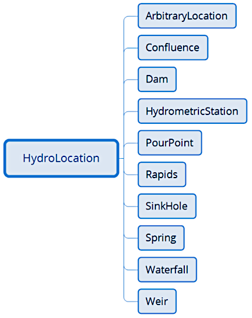

#### Arbitrary Location

An arbitrary location is a hydro location of indeterminate type. It may
be used to reference other phenomena not included in the other values
described below.

#### Confluence

“Joining, or the place of junction, of two or more streams.” \[HY\_F,
WMO\]

#### Dam

“Barrier constructed across a valley for impounding water or creating a
reservoir.” \[HY\_F, WMO\]

#### Hydrometric Station

“Station at which data on water in rivers, lakes or reservoirs are
obtained on one or more of the following elements: stage, streamflow,
sediment transport and deposition, water temperature and other physical
properties of water, characteristics of ice cover and chemical
properties of water.” \[HY\_F, WMO\]

#### Pour Point

“Specified catchment outlet defined to delineate a catchment upslope
from that point.” \[HY\_F\] Pourpoint (or pour point) is not listed in
the WMO glossary, but it is a very useful concept. CHyF provides a
service that allows for various ways of specifying a pourpoint.

#### Rapids

“Reach of a stream where the flow is very swift and shooting, and where
the surface is usually broken by obstructions, but has no actual
waterfall or cascade.” \[HY\_F, WMO\]

#### Sinkhole

“Place where water disappears underground in a limestone region. It
generally implies water loss in a closed depression or blind valley.”
\[HY\_F, WMO\]

#### Spring

“Place where water flows naturally from a rock or soil onto land or into
a body of surface water.” \[HY\_F, WMO\]

#### Waterfall

“Vertical fall or the very steep descent of a stream of water.” \[HY\_F,
WMO\]

#### Weir

“Overflow structure which may be used for controlling upstream water
level or for measuring discharge or for both.” \[HY\_F, WMO\]

### Hydro Network

In HY\_Features the hydro network type realizes a catchment as a network
of connected hydrologic features. The term network implies: (i), that
the set of connections can be modelled as nodes connected by edges, and
(ii), that the features can all be connected through the network. Where
features cannot all be connected, then there exists two or more
networks, although they may all be included within the same mathematical
graph.

A number of different kinds of networks are recognized, as noted below.
Since a hydro network is a network of hydrologic features, catchment
network, channel network, and hydrographic network are considered as
types of hydro networks. Flowpath network and catchment divide network
are realizations of a catchment; however, they are first and foremost
networks, which is why they are included here in this logic diagram.

#### Catchment Divide Network

A catchment divide network consists of a set of catchment divides
connected to one another at vertices. The resulting mesh implicitly
includes the bounding segments of individual catchments within a larger
catchment.

#### Catchment Network

A set of catchments connected through hydro nexuses. \[after HY\_F\]
Each catchment has one or more neighbouring upstream catchments and one
or more neighbouring downstream catchments, with the exception of the
highest and lowest catchments in the network.

#### Channel Network

“Connected set of depressions and channels that continuously or
periodically contain water.” \[HY\_F\] Practically, a channel network is
a superset of a hydrographic network, (i), since lakes and rivers can be
considered as being contained by depressions and channels, and (ii),
since other channels exist that are not considered as lakes or rivers.

#### Flowpath Network

The set of all flowpaths forming a connected network within a catchment
and realizing that catchment. If interior catchments are included in a
larger catchment, then the contained flowpaths may form more than one
network. The network or networks contain no cycles whereby flow can move
through flowpaths and return to its starting point. It need be only
acyclic and directed downstream throughout. Divergences are allowed,
such as with flows around islands, flows through braided channels, and
flows on deltas. However, if only primary flowpaths are considered
through a network, then the network is dendritic in nature.

#### Hydrographic Network

“Aggregate of rivers and other permanent or temporary watercourses, and
also lakes and reservoirs, over any given area.” \[WMO\] Using the
terminology in this document (and consistent with HY\_Features), a
hydrographic network consists of an acyclic, directed network formed by
waterbody features.

### Hydro Node

A hydro node is a network construct equivalent to a node or a vertex,
and existing at each endpoint of a flowpath. A hydro node that is
treated as a permanent feature and identified through a persistent
identifier is said to be contracted. It is a reference location defined
to support interoperability. \[after AHGFNode in AHGF\] Any type of
hydro node potentially could be contracted, but the most likely
candidates are hydro nexuses.

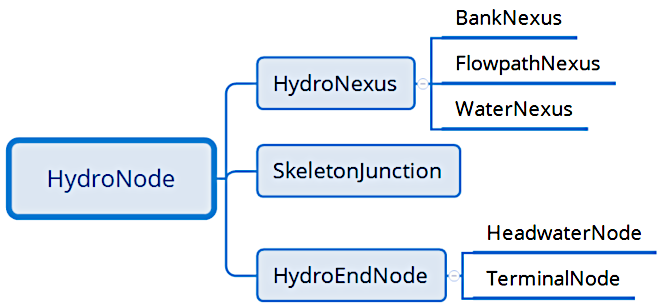

#### Hydro Nexus

A “... hydro nexus represents the place where a catchment interacts with
another catchment, i.e. where the outflow of a contributing catchment
becomes inflow into a receiving catchment.” \[HY\_F\] A hydro nexus
exists where adjacent flowpaths touch in a flowpath network and where
that location acts as the interface between two or more catchments.

##### Bank Nexus

A bank nexus is a point representing the interface between a bank
catchment and a water catchment. Because of its relationship to the two
catchments, it is considered as a type of hydro nexus and not a hydro
end node. A bank nexus is equivalent to the upstream endpoint of a bank
flowpath.

##### Flowpath Nexus

A flowpath nexus is a point representing the interface between a reach
catchment and either another reach catchment or a water catchment.

##### Water Nexus

A water nexus is a point representing the interface between two water
catchments.

#### Inferred Junction

An inferred junction is a confluence point on a flowpath network that
does not represent the interface between catchments. It occurs in lakes,
rivers, and estuaries as a means of establishing network connectivity.
It is always coincident with an endpoint of one or more inferred
flowpaths.

#### Hydro End Node

A hydro end node exists at the start points and endpoints of a flowpath
network. These are referred to respectively as a headwater point or a
terminal point. A bank nexus is considered as a hydro nexus and thus is
not considered as a hydro end node.

An attribute indicates whether the hydro end node is on the boundary of
the area of interest where data is available. Note that the attribute
applies to both headwater nodes and terminal nodes.

##### Headwater Node

A graph endpoint hydro node used to specify the start of a flowpath,
where there does not exist any inflowing flowpath. It corresponds to the
the start of a headwater (first order) stream. A flowpath exists
downstream of the headwater point, but none is defined upstream of it. A
headwater node usually has a valence of 1.

##### Terminal Node

A graph endpoint hydro node used to specify the end of a flowpath that
is not connected to any further downstream flowpath. It acts as the
terminus of a flowpath network. A terminal node usually has a valence of
1.

### Reservoir

“... a concept of water storage … \[allowing\] any waterbody type to be
considered a managed reservoir.” \[HY\_F\] Thus a lake or a section of a
large river may act as a reservoir, a term that describes the use of the
waterbody, as opposed to a type of waterbody. A dam or some other type
of water control structure usually exists on the boundary of a
reservoir.

## Conventions

This section provides details that will be helpful in understanding this
document.

### Abbreviations

DEM: Digital Elevation Model (defined by a grid or a point cloud)

GWML2: GroundwaterML 2

GPS: Global Positioning System

HY-F: HY\_Features

HY\_Features: OGC® WaterML 2: Part 3 - Surface Hydrology Features
(HY\_Features) - Conceptual Model

ISO: International Organization for Standardization

OGC: Open Geospatial Consortium

UML: Unified Modeling Language

WGS: World Geodetic System

WMO: World Meteorological Organization

### Formal Model Notation

The modelling diagrams make use of UML, with class names specified in
UpperCamelCase and property names in lowerCamelCase.

### HY\_Features and WMO Terminology

CHyF makes use of terminology from HY\_Features and WMO as much as
possible. In some cases the meaning is identical. In others it is
sufficiently similar so that the same term is used. In some cases small
differences may exist with some class properties.

CHyF also introduces a number of classes required for implementation,
while ignoring others that are not required or where the CHyF and
HY\_Features models are intentionally divergent. For example,
HY\_Features supports linear referencing for those who wish to use it.
CHyF intentionally does not support linear referencing, but instead is
directly compatible with direct referencing through WGS coordinates
(often referred to as GPS coordinates) and CHyF web services.

Like HY\_Features, CHyF avoids the use of many common terms, such as
*watershed* and *basin*. With some terms HY\_Features describes the
respective concepts, but does not include them in its model, whereas in
CHyF the terms are included formally; *catchment coverage* and *main
flowpath* (also referred to as *mainstem*) are examples.

As an implementation model, CHyF specifies the geometric representation
of features. In all cases this is a necessary requirement for
implementation. In some cases though, it is done to be able to take
advantage of fast computation or navigation. For example, a nexus in
CHyF is always represented as a point, to simply compatibility between
geospatial representation and graph theoretic algorithms. In CHyF a dam
may be located at a hydro nexus, whereas in HY\_Features the dam might
be defined as a hydro location of type dam, without reference to
geometric representation.

### Naming Conventions

Formal names of elements within CHyF make use of the prefix CA\_, in
line with OGC and ISO naming conventions. The relationship to
HY\_Features model elements, with the prefix HY\_, is described where
applicable. It is also defined in a crosswalk in Appendix 1. CHyF is an
acronym for Common Hydrology Features model and CA\_ indicates common
applications, for which CHyF is designed to be applicable.

### Language Support

As with HY\_Features, formal class names are based on English. Names
assigned to features however can be in one or more languages. For
example, the *Pouce Coupe River* flows in British Columbia and Alberta.
In French it is called the *rivière Pouce Coupé*. Both names can be
supported without the use of codes. The modelling approach used in
HY\_Features is also used in CHyF, as described in section xx.
Implementation detail, as given in section xx, modify this for ease of
use by the end user.

## Conceptual Model

### Introduction to CHyF

CHyF is a practical implementation of the conceptual model presented in
HY\_Features. Both models define hydrologic features and different kinds
of networks based on these features. Collectively, these concepts define
a domain. That domain centres on a geospatial representation of the flow
of water through river systems and through the drainage areas on the
landscapes that contain them. A core concept in CHyF, which extends
HY\_Features, is that these features and their relationships can be
represented in a mathematical graph, referred to as a hygraph. Features
in CHyF are defined in such a way to make the benefits of the hygraph
particularly useful to practicing hydrologists, environmental
specialists, and water managers.

#### CHyF Overview

HY\_Features establishes the concepts of catchments, flowpaths, and
hydro nexuses, and CHyF extends each of these for operational purposes.
In order to leverage graph theory, CHyF defines basic versions of these
that then become the objects (i.e., nodes) in the hygraph. These
elemental objects are referred to as elementary catchments, elementary
flowpaths, and nexuses. An elementary feature or elementary flowpath can
be subdivided, to help define a location or area of interest; this
results in smaller elementary features (similar to cell division). Thus
the basic idea of having elementary features in a graph does not change.

HY\_Features does not indicate what a given catchment can contain. The
NHDPlus allows reach catchments (the smallest catchments in its system)
to include arbitrary amounts of land and water in the vicinity of
polygonal waterbodies. By contrast, CHyF does not. Precipitation falling
on a waterbody or on land is very different hydrologically, as are the
processes within surface waters compared to within terrestrial surficial
materials. Consequently with CHyF, catchments are either land-based
areas or water-based areas, but never a mixture of the two. Just as with
terrestrial catchments, polygonal waterbodies can be subdivided; this
allows for example for the creation of nearshore zones or river sections
as elementary catchments.

The central concept in HY\_Features is that of a catchment. Flowpaths
and catchments divides are modelled as realizations of catchments. CHyF
makes use of the same modelling constructs, but as an implementation
model involving both data and services, its central concept is
different. It emphasizes a series of intertwined, topologically
harmonious networks that can all be related through graph theoretic
constructs, and that collectively form a hydro fabric represented by a
CHyF dataset.

This hydro fabric serves as a terrain representation that can be used as
the common space on which entities of interest are located and related,
ranging from rivers to hydrometric stations, to floodplains, to
agricultural and urban developments. The starting point is often a
hydrographic network formed from waterbody features. In the figure
below, an area is shown in the Richelieu Watershed in southern Quebec.
The hydrographic network includes the cyan waterbodies and the blue
streams, and excludes the skeletons in Lac Hertel and the Rivière
Richelieu. The blue lines, including those shown as waterbody skeletons,
form a flowpath network.

From the hydrographic and flowpath networks, and a DEM if available, a
catchment coverage can be created that in most respects is the dual of
the flowpath network, as shown in the figure below. The catchments forms
an associated network, as do the bounding linestrings that define the
catchment divides. The nexus points at the beginning and end of every
flowpath segment form yet another network. If channels were extracted
from depressions in a DEM, then those channels in combination with the
hydrographic rivers will form a channel network that ideally will be
consistent with the other networks.

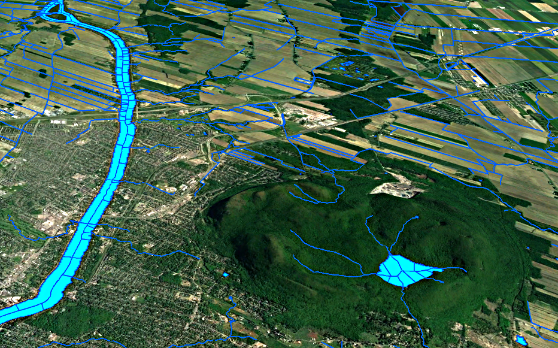

The various networks are all composed of network elements. Network
elements of the same type have relationships, as do those of different
types. These relationships form the basis of navigating through the land
and waterscape. The power and beauty of the CHyF model emanate from the
interwoven topologies of these networks. If the geometry of the
underlying features is well defined topologically, the hygraph can be
quickly generated and very fast traversal through it becomes possible.
This enables a number of web services that can be used to return
hydrologic features data meeting specific connectivity criteria. It also
allows for a simpler model in comparison to some that are currently in
common use, as functions that are often embedded in data through coding
systems can be generated on the fly instead.

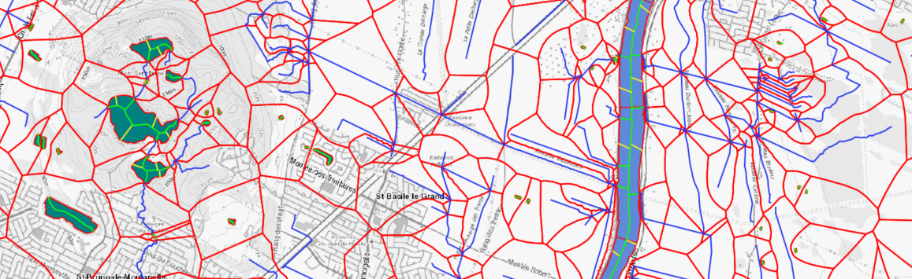

#### Basic Model Concepts

In what follows, key terminology is explained, but many of the details
are intentionally not provided. They are available elsewhere in this
document (see section xx and xx).

##### Catchments and Waterbodies

Similar to the NHDPlus, CHyF defines a coverage composed of basic
catchments. In CHyF these are referred to as elementary catchments. The
figure below shows two major catchments. The one on the right is
rendered in light green with a lake in the middle. The one on the left
is in dark green and also contains a lake.

Catchments A, B, C, and D are typical catchments of first order rivers;
the areas defined by each drain into the respective river segments, a,
b, c, and d. Catchments J and K each contain a single-line river
segment, j and k, respectively, which transects the given catchment.
Catchments E, F, G and H do not contain rivers. It could be that such
streams do exist but are not visible at the given scale. However, it is
also possible that no such streams are present. The flow of water from
the land to the lake may be overland (on the surface), through surficial
materials (the soil), or at the base of such materials over the surface
of buried bedrock or an impervious layer. The lake in the middle of
these catchments corresponds to a catchment in its own right, labelled
I.

Z refers to another catchment that is geometrically equivalent to a
lake. It is surrounded by Y, that like E through H does not contain a
waterbody. Y and Z together form what is referred to in Hy\_Features and
CHyF as an interior catchment. Given the data available, it does not
appear to connect to other catchments, so it is simply treated as an
internally drained area, not contributing to the flows in neighbouring
areas that ultimately drain to the ocean.

CHyF follows Hy\_Features in using the term waterbody to refer to any
body of water. Rivers, lakes, and estuaries are considered as
waterbodies. CHyF also includes some types not recognized in
HY\_Features or NHDPlus, such as nearshore zones, oceans, and subsurface
contained flows (e.g. storm drains).

In the case of a large lake or a river with polygonal geometry (often
referred to as a double-line river), the waterbody may be broken into a
series of catchments, as discussed later. Of importance here is that a
catchment consists of either an area of land or an area of water but not
areas of both land and water. Each of those elementary catchments (A, B,
C, D, J, K) with a single-line river (a, b, c, d, j, k) do in fact
contain a waterbody, albeit one with linear geometry.

In CHyF, catchments and waterbodies are not analogous or symmetric
concepts. All waterbodies are in catchments; the reverse is not true.
Some catchments are geographically equivalent to waterbodies, as with I
and Z above. Others do not contain waterbodies, as with E through H,
whereas others do, as with A through D, J and K.

It could be argued that at a more detailed scale, the single-line
streams would be represented as double-line streams and that therefore
this distinction between water catchments and land-based catchments is
not valid. However, precipitation falling on water behaves very
differently from that falling on land, so to the degree that such a
distinction can be made, it should be. At different scales the breakdown
into elementary catchments will differ, as some lakes and rivers appear
or disappear and as different geometric representations apply.

##### Flowpaths and Hydro Nodes

Figure xx above is missing analytical elements. The same area is
depicted below, with additional features added to enable effective
network definition.

HY\_Features uses the term hydro nexus specifically as the interface
where one catchment flows into another. CHyF accepts that definition but
adds hydro node as a more general term and hydro endpoint as a type of
hydro node that indicates the end of a flowpath network. So the
headwater points (shown as white dots) are hydro nodes, but not hydro
nexuses. Similarly a terminal point on a flowpath network may exist at
the boundary of an area of interest, or in an interior catchment,
without connecting to another waterbody. In either case such a point
(shown as a gray dot) is a terminal point, which also is not considered
as a hydro nexus.

Each red dot is a simplified network representation of a node, where one
waterbody meets another, and where one or more catchments flows into
another. As hydro nexuses, they also represent where flowpaths meet. The
green dots are located on the banks of the waterbodies. Each is
considered a hydro nexuses representing a shoreline segments separating
a land based catchment from a waterbody with polygonal geometry. Such
points do not have a counterpart in the NHDPlus model.

The black dots are referred to as inferred junctions. They connect the
black skeletal elements in polygonal water bodies. They exist only to
support network connectivity and are not considered as nexuses but not
hydro nexuses. Not shown in this figure but present in the next (figure
xx), are blue dots. They are hydro nexuses acting as interfaces between
water catchments, such as between a lake and a wide river.

Elementary flowpaths are defined as flowpath representations between
hydro nodes. The single-line streams, {a,b,c,j,k}, were observed at the
time of mapping; they are depicted in blue. The black segments, inferred
across the lake, serve as general connectors, necessary to form a
flowpath network. The green segments represent the flow from the banks
along the lake. The orange segment in this example, d, is an assumed
river or channel. The flowpath representing it is considered to be a
construction, drawn in this case to connect a spring to the nearby
river, following a presumed path across the terrain. The resulting
overall structure allows for paths to be traced from every observable
waterbody to the ocean as well as from every catchment to the ocean, or
in the case of an interior catchment or the boundary of the area of
interest, a terminal point.

All waterbodies have associated flowpaths, even isolated lakes as
exemplified by catchment Z. This is done to allow for consistent
treatment of all features in the context of the hygraph (section xx).

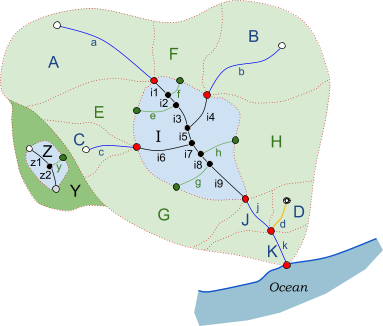

In the figure below one large catchments is composed of 16 elementary
catchments, A through P. B and K contain secondary flows. If the
secondary flows are ignored, then B and C would form a single catchment,
as would also be the case with K and L; however, as CHyF does not
require a dendritic pattern, there is no advantage in doing so, so long
as all connections at flowpath endpoints are defined, as shown.

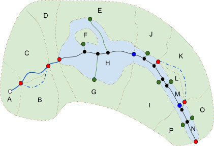

The lake with the island and the double-line river are broken into water
catchments, with the blue dots representing the hydro nexuses where each
water catchment flows into its downstream neighbour. The separation of
the lake from the river is marked by a hydro nexus and a catchment
divide segment that meets similar segments on the two opposing banks.
The river could continue for many kilometres before it meets another
polygonal waterbody. Alternatively and more appropriate for some
applications, it could be broken into a series of water catchments. The
subdivision of large waterbodies into smaller ones can be arbitrary,
e.g., every two kilometres, or could be meaningful as is the case with
the two boundaries across the water as shown. The separation of H and M
is based on the former being considered a lake and the latter a river.
The separation of M and N is based on continuing the boundary on the
other side. Note that the boundary between J and K does not continue
through the water and across the opposite side. So long as the flowpath
connections are made, any of these subdivisions are acceptable.

A few other characteristics evident in the figure are of note. (i) In
the previous figure (figure xx), the red and green dots alternate around
the lake. This is common pattern. However, in this figure (figure yy),
neither I nor its neighbour P contains a stream, so drainage from each
is represented by a green dot, resulting in the two green dots being
neighbours along the bank of the river. (ii) Catchment F is an island
that does not contain a stream. Nevertheless the island is connected to
the river through a flowpath extending from its bank to the inferred
flowpath in the middle of the river. (iii) Along the skeleton in the
lake, most intersection points have a valence of three (three edges meet
at the junction). The most downstream junction (black dot) in water
catchment N has a valence of four. The two blue hydro nexuses have a
valence of two. The CHyF model does not have a required or preferred
value for the valence of such intersection points.

In figure xx above, less important braids are represented as secondary
flows (rendered as patterned blue lines). The same distinction also
applies to flows below any divergence, including distributaries, as
found on deltas (figure xx below).

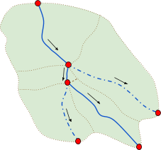

##### Subdivisions of Flowpaths and Catchments

Flowpaths and hydro nexuses may be defined somewhat arbitrarily if a
point of interest exists along a stream. In the upper half of figure xx
below, this is demonstrated with a hydro nexus of valence 2 (two
segments touch the common vertex) placed in the middle section of the
flowpath network (the red dot with a white x). It may correspond to a
proposed culvert location for example. Adding this hydro nexus leads to
the original elementary flowpath at that location broken into two
elementary flowpaths and the original elementary catchment broken into
two corresponding elementary catchments.

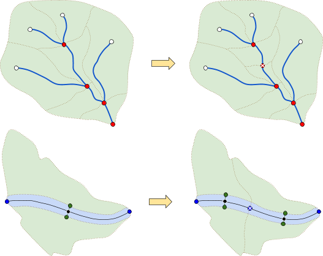

If the new nexus is placed in a double-line river as shown in the lower
half of the figure, the situation is more complicated, but the same
principles apply. The original three elementary catchments consist of
two opposing river banks and a portion of the river. These three are
each broken in two, with six elementary catchments then resulting. The
black line segments are flowpaths, which double in number with the
introduction of the new catchment divide segments (depicted as dotted,
brown lines). The same is true of the number of nexuses, if the shared
(blue) water nexuses at either end are each considered as contributing a
half to the area in question.

##### Catchment Divides

Figure xx below is equivalent to figure xx above, but with only the
catchments and their boundaries showing. The endpoints of the bounding
segments are indicated with an **x**. These bounding segments in CHyF
are referred to as catchment divide segments that can be assembled to
form catchment divides, which also exist in HY\_Features. A catchment
divide is any arbitrary path through the catchment divide segments,
including but not restricted to the complete boundary of any given
catchment. The catchment divide segments are comparable to elementary
flowpaths, with particular paths through them of hydrologic
significance.

CHyF recognizes two approaches to the creation of catchment divide
segments. The first involves a medial axis between waterbody features,
ignoring elevation data. This places the divides halfway between nearby
waterbodies that may have either linear or polygonal geometries. This is
appropriate on flat terrain where the elevation surface may not have
sufficient resolution to indicate accurately the direction of flow. The
second approach to generating catchment divide segments takes elevation
into account, such that flow direction and thus the position of the
divide is consistent with downhill flow over the surface. This is the
more common situation, especially in areas of noticeable relief. A
combination of the medial axis and elevation aware approaches is also
possible.

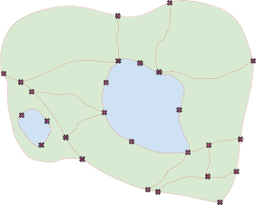

Catchment divide segments form a mesh that can be modelled as a graph.
Depending upon the algorithm used, the graph may be of interest when
determining the correct location of these segments on a triangulated
surface formed from an elevation point cloud and a set of vertices from
waterbody geometries.

##### Depressions and Channels

Depressions are concavities that contain or potentially contain water.
They may be small pits that can be removed by software processes;
however, in some cases they may be of significant size and could
represent interior catchments that do not generally contain a waterbody.
Depressions may also take the form of channels and support or
potentially support water flow. Headwater ephemeral streams are good
examples that may be mapped simply as channels. Complex gully systems
and arroyos could be mapped similarly.

With the advent of lidar mapping, elevation point clouds or grids may be
analyzed with the intention of defining waterbodies, and additional
depressions and channels. This may result in isolated depressions and
discontinuous channels. In some cases it may be evident that two
channels are connected by a culvert through a roadbed for example. In
other cases the topography may suggest that they must be connected. In
both situations connections may be made to form a continuous network by
adding constructed (assumed) sections. If connections are made, then the
derived channel can be combined with other hydro features to form
continuous hydro networks. If not, then they can be still be modelled by
CHyF, with interior catchments resulting from the discontinuities.
Depending upon the objectives of a given use case, this may or may not
limit the applicability of the data.

*See if Sherbrooke has an appropriate figure.*

##### Hierarchical Catchments and Partitioned Catchments

Large catchments may be composed of smaller catchments in different
ways. Shown below in figure xx is a hierarchical structure with the
large green catchment containing two catchments plus a lower remnant
catchment. Each of the two upper catchments can be further subdivided in
a recursive fashion. With such a hierarchy of order n, a given
elementary catchment may be contained in from 1 to n catchments,
including itself. As depicted, the four headwater catchments are in
first, second and third order catchments; the lowest elementary
catchment is only in the third order catchment. Hierarchically specified
catchments by definition overlap one another.

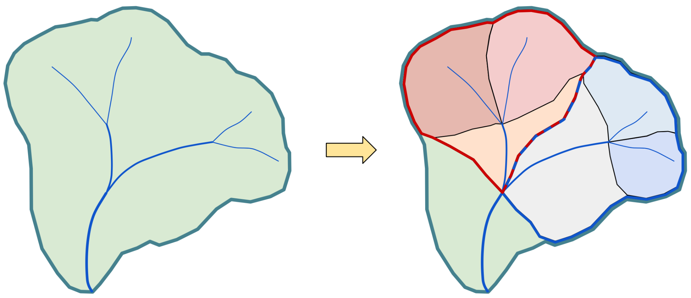

Another way of considering the area in question is simply as three
non-overlapping catchments, with the upper two flowing into the lower
one, as depicted in figure xx below. The three catchments can be said to
partition the overall watershed. Partitioning implies (i), that all
inflows to a lower catchment (Z) flow through a single hydro nexus (P),
and (ii), that P is upstream of all parts of Z. Partitioning may apply
to inherently hierarchical structures as well. If on the right side of
figure xx above, each of the seven visible areas is treated as a
catchment in its own right, then the overall catchment can be said to be
partitioned as described here.

Although not shown graphically, if X, Y, or Z (in figure xx below)
contained any interior catchments, they would still partition the larger
catchment. At a practical level, major catchment aggregates are
typically defined using a partitioned approach.

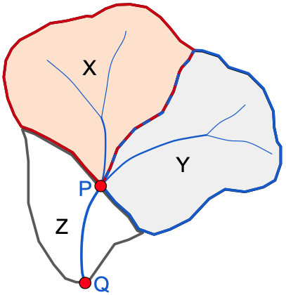

The situation above is in contrast to the subdivision shown below on the
left side of figure xx below. In that example, three non-overlapping
catchments are defined, with C as the area remaining from the overall
catchment after removing A and B. A and B both flow into C, but C is not
completely downstream of either. From a hydrological modelling
perspective this is not ideal.

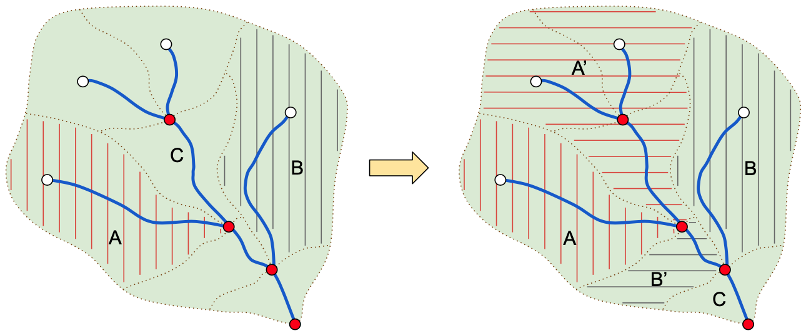

This situation is remedied by the further breakdown shown on the right
side of figure xx. A’ drains into the same hydro nexus as A, and they
both flow into B’; similarly, B’ and B flow into C through a common
hydro nexus. These four catchments plus C as depicted do meet the
condition of being partitioned components of the overall catchment.

For a real world example, consider the Susquehanna River Basin, shown in
figure xx below. It is broken into six non-overlapping catchments. N1 is
a hydro nexus serving as the outflow for the Chemung and Upper
Susquehanna Subbasins. N1 is also the inflow for the Middle Susquehanna.
Further downstream at N2, the West Branch and the Middle Susquehanna
Subbasins flow into the Lower Susquehanna Subbasin. So far these
subbasins taken together meet the partitioned definition described
above.

At N3 the situation is different. The Juniata River joins the
Susquehanna River, with part of the Lower Susquehanna Subbasin above
that confluence and part of it below the confluence. If a catchment
divide were drawn, approximately as shown by the white dashed line, then
the Lower Susquehanna Subbasin could be split into a northern area and a
southern area. The net result would be a set of seven partitioned
catchments covering the Susquehanna River Basin. As shown though,
without the white dashed catchment divide this is not the case.

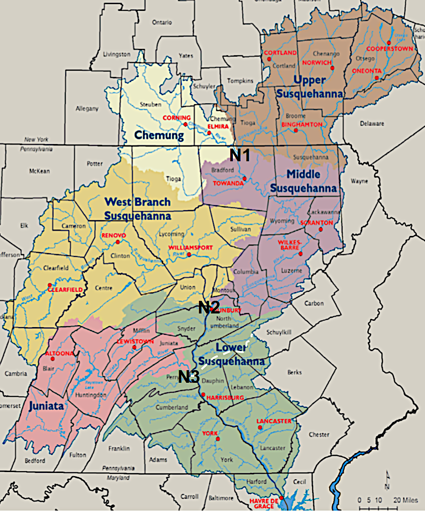

##### Nearshore Zones and Large Waterbodies

The figure below is part of the drainage for a large lake with four
inflowing rivers and one outflowing river. The corresponding reach
catchments for these rivers are rendered in light green with the bank
catchments between them in yellow-green. The flowpaths are shown by
arrows indicating the direction of flow. The nearshore zone is depicted
and is subdivided into 10 units bounded by the heavy brown lines. The
enlargement on the left is in the middle of one of the nearshore zone
units, whereas that on the right is on the boundary of two of the units.
The blue, black and green nexus points are as before.

Whether the nearshore zone is subdivided or how it is subdivided is up
to the user. The inner boundary may for example be based on bathymetric
data, on the location of the littoral zone, or on a buffer zone of a
given dimension. The breaks along the zone could be based on influence
areas from inflows, on the locations of towns or industrial areas, or on
set lengths along the shore. CHyF only imposes the requirement that one
or more flowpaths exist in each waterbody and that these flowpaths can
be constructed into a directed acyclic flowpath network that meaningful
represents the general flow of water. As shown, each of the nearshore
zone units plus the middle of the lake are treated as water catchments.
Flow is assumed along the shore toward the outlet and away from the
shore to deeper water.

The kind of treatment shown in this figure could be applied to the Great
Lakes, other large lakes, large rivers, estuaries or along the
coastline. This flexibility increases the potential application space to
which CHyF data and services can be applied.

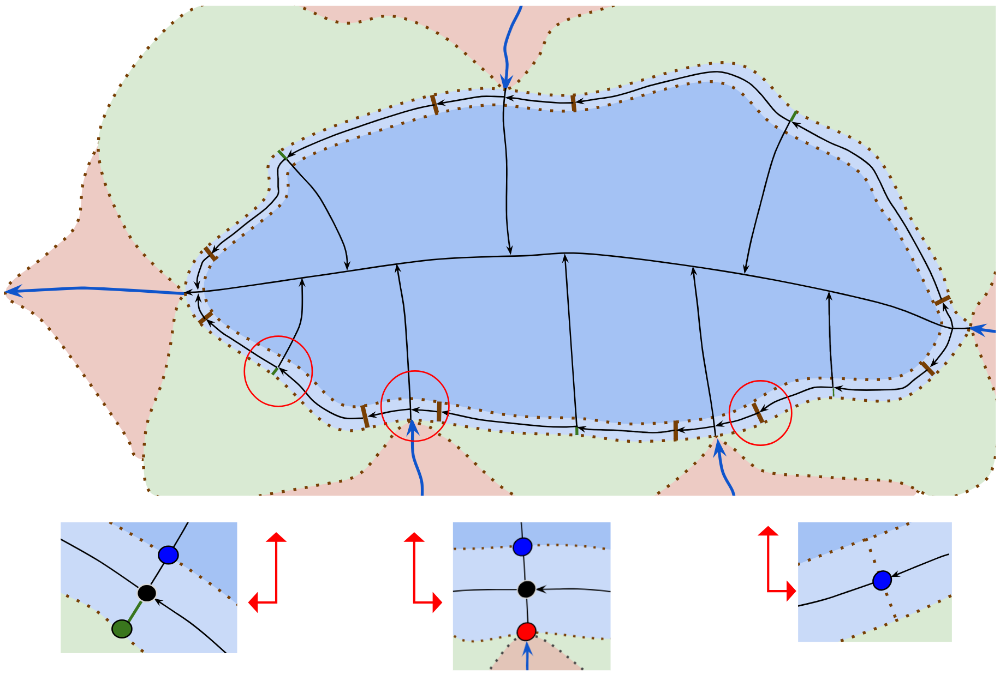

##### Hydro Locations

Locations on or near flowpath network may be of particular interest. If
they are of direct hydrological significance, they are referred to as
hydro locations. This term is used in both HY\_Features and CHyF.
HY\_Features provides a list of possible hydro locations, but allows for
other lists to be used instead. CHyF provides an alternative list, which
includes the following: Dam, Hydrometric Station, Pour Point, Rapids,
Sinkhole, Spring, Waterfall, and Weir. The members in this list are
commonly included in government mapping programs or are of direct
interest to hydrologists and environmental specialists, which is why
they are included here.

Other features could have been added to the list, including many that
are not necessarily of interest to the hydrological modelling community.
CHyF services related to location can be applied to hydro locations, but
they can also be applied to other locations that can be represented
geometrically by a point on or near a stream. The upstream catchment of
an arbitrary pour point on a stream may be of interest. However, the
same is true of a fish inventory site or even of the location of where a
cadastral or administrative boundary intersects a stream. Such sites are
not considered to be hydro locations, even though from a services
perspective they are treated no differently.

#### The Hygraph

Mathematical graph theory can be used to navigate through relationships
between elementary catchments, elementary flowpaths and nexuses. This
can be implemented in different ways, but the basic ideas are presented
here. The figure below adds another interior catchments to figure xx, Q,
which represents a depression without any contained waterbody at the
time of mapping. As well, another catchment, W, is added to the left,
and the ocean is ignored.

Two large catchments are evident, one consisting of the elementary
catchment W and the other of a set of elementary catchments, A … K. Y-Z
exists along the boundary of both and is not contained by either.
However, they both have a common outlet, where they enter the Ocean. An
upstream query from that nexus point would include A through K, plus W,
but exclude Q and Y-Z. Alternatively, the query could specify that
everything within its outer boundary be included, in which case A...K,
Q, W, and Y-Z would all be included.

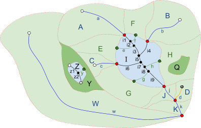

The nexuses are not identified individually in the figure above.
However, they are in an actual implementation, where the flow from one
catchment to another or from one flowpath to another is always through a
hydro nexus. For example, catchments J, D, and K have flow relationships
through hydro nexuses (labelled below as *m, n,* and *o*). Collectively
these features and their relationships can be represented as part of an
Directed Acyclic Graph defined by alternating hydro feature - nexus
sequences.

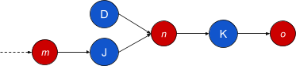

Flowpaths d and j flow into flowpath k through *n* as well. For reasons
of clarity, the hydro nexuses are not shown in the diagrams that follow,
but should be assumed to be present throughout.

With that understanding, the flow relationships between the elementary
catchments and the elementary flowpaths are shown in the following
figure. The relationships in the larger catchment draining into the
ocean are shown by the large green, blue, and brown subdiagrams on the
left. The relationships in the interior catchment Y-Z are shown on the
right. The interior catchment Q has no flow relationships and is found
in the upper right.

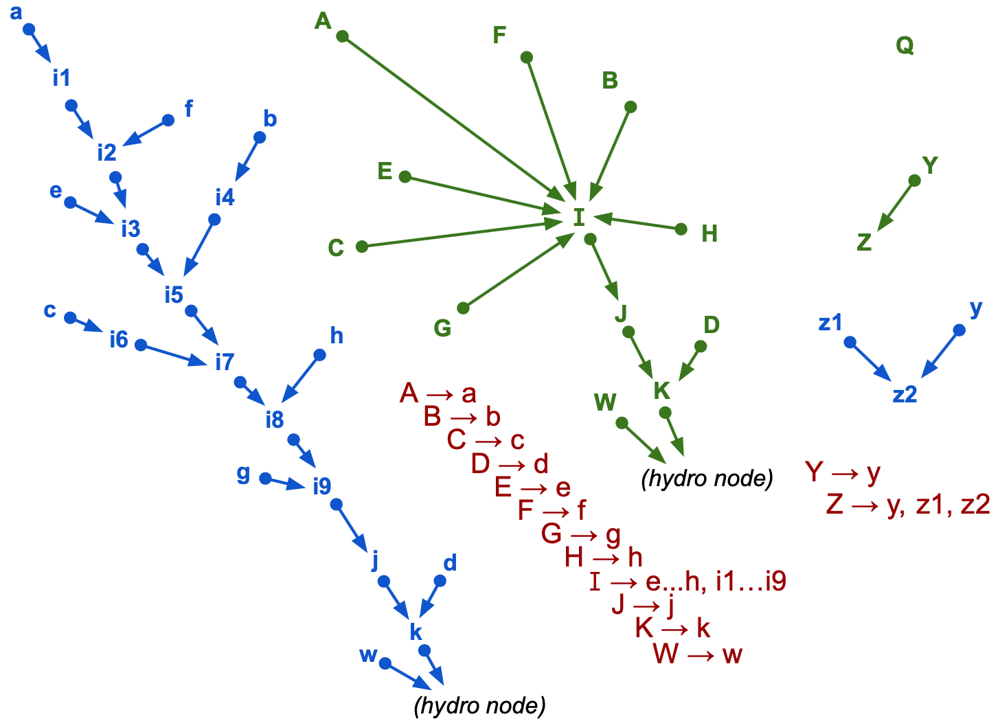

Using the catchment to flowpath relationships in brown, the seven
subfigures above can be reduced to three, as shown in the next figure.
G0 is large, containing many connections. G1 is much smaller but still contains several connections. G2, corresponding to an empty catchment, includes a null set of flow
connections.

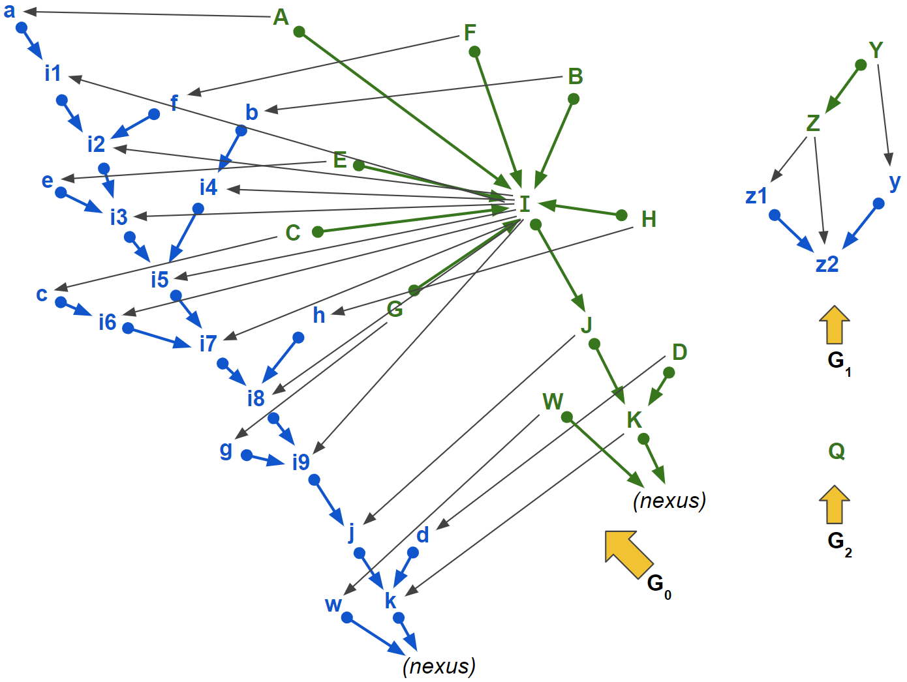

Each of the three subfigures represents a connected Directed Acyclic
Graph (DAG). These three DAGs are associated with three separate
catchments. However, it is also reasonable to amalgamate the three into
a single catchment identified as the area of interest, or the universe U
under consideration. In this more general case, U is defined as a set of
DAGs as per the following expression.

> U ← {G0, G1, G2, ...}

Each DAG, Gi, is a component of the graph U. The hygraph is
an implementation of this expression for any arbitrarily large catchment
or set of catchments.

As noted earlier, the hydro nodes are taken into account in the
construction of the hygraph. They serve as interfaces as well as start
and endpoints and are required when implementing this graph approach.
Each flowpath graph G can be defined as a tuple of flowpaths,
catchments, hydro nodes, flow relationships and containment
relationships. This expression can apply to the entire graph or to each
individual DAG.

> Network Flow Graph ← (Flowpaths, Catchments, Hydro nodes, Flow Relationships, Containment Relationships)

Using abbreviations, this can be written more compactly.

> G ← (F, C, N, FR, CR)

The expression below states that the flow relationships are defined by a
set of relationships between x and y, where x flows into y if either of
the following two conditions holds: (i) x is a flowpath or catchment and
y is a hydro node, or (ii), x is a hydro node and y is either a flowpath
or catchment. This has the same meaning as stating that a flowpath flows
through a hydro node into a catchment or another flowpath, or a
catchment flows through a hydro node into a flowpath or another
catchment. Another way of considering this expression is that it
indicates what is happening at every hydro node.

> FR ← {(x,y) | (x ϵ F∪C and y ϵ N) or (x ϵ N and y ϵ F∪C)}8

The next expression defines containment relationships as a set of
relationships between catchment c and flowpath f.

> CR ← {(c,f) | c ϵ C and f ϵ F}

We also define that each flowpath, f, is within a catchment, c. This
does **not** imply that these relationships
are of a one-to-one nature; similarly, this does **not** imply that every catchment contains a
flowpath. An examination of the previous map figures demonstrates these
situations.

> ∀ f ϵ F: ∃ c | (c,f) ϵ CR

These expressions give rise to a number of topological rules that are
the subject of a later section in this document.

As demonstrated here, the hygraph may contain connected or disconnected
elements. Because the feature connections are all within the same graph,
navigating through the features is straightforward. Downstream and
upstream relationships are readily determined, as are interior
catchments. Braided streams, lakes with multiple outlets, and deltas can
all be handled in the same way as classic dendritic patterns.

#### Temporal Considerations

##### Hygraphs and Time Series

Although outside of this release of the CHyF model and services, the
hygraph concept can be applied against time in different ways. Assume
that three snapshots of a given area exist. These different versions may
be based on set time intervals, given events, or simply the availability
of applicable data. For each version, a hygraph U can be calculated as
described above. This situation is depicted in the figure below.

For the area in question, a time series can be established for time t1,
t2, t3,
etc.:

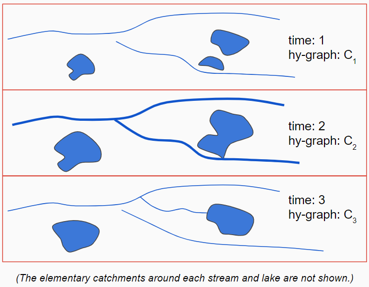

> T ← {Ut1, Ut2, Ut3, …}

For example, t1, t2, t3, and t4 could refer to 1980, 2000, 2020, and
2040, or to any particular times of interest. The underlying assumption
here is that a different hygraph, U, applies to the entire area for each
time.

##### Hygraphs and Recurring Floods (experimental)

The different times may represent different return periods. For example,
the 5 year, 10 year and 100 year return periods can be shown as a
hygraph series as follows:

 > R ← {Ur5, Ur10, Ur100}

This approach assumes that separate, non-related hygraphs are modelled
for each return period. An alternative approach that integrates the
geography of the recurring floods into a single hygraph is as follows.

Within the universe U there exists an arbitrary number of
non-overlapping Modified Areas of Potential Flooding (MAPFs) for which
floodplain analyses have been performed. A particular MAPF refers to a
given location subject to flooding, such as a specific town or
agricultural area. It encompasses all observed or estimated flooded
terrain for that particular location. The largest of these areas, which
might be for example correspond to the 100 year return period flood, is
used as follows. The MAPF is the merged area of all elementary
catchments that are completely or partially underwater, based on that
largest flood.

Let a given  MAPFi be represented by the subgraph
Si of U. Multiple versions of the subgraph can be defined, one for each value of x, where x represents the x year return period flood. The general case is denoted as Si(rx), with Si(r0) being the subgraph for the not-flooded state. For the MAPFi a collection of subgraphs can be defined, each of which represents the entire  MAPFi under a different flooding
extent.

> Ci ← {Si(r0), Si(rx1),Si(rx2), ... }

Ci is a collection of subgraph options for the area within the APFi. For the area outside of the APFi a subgraph is necessary, referred to as S!i, i.e., Snot\ i. The entire graph, U, can then be defined as the subgraph for the area outside of the MAPFi combined with the subgraph for the area inside the APFi, with the latter a member of Ci. In the expressions below, the + sign means combined into a common graph. Ui(rx) is the entire graph taking into account flooding in a given location, with the maximum extent of the flooding defined by MAPFi , and with a flood recurrence interval of rx.

> as a general statement:
> 
> Ui(rx) ← {S!i + Si(rx)}
> 
> and for the not flooded state:
> 
> Ui(r0) ← {S!i + Si(r0)}

The representations of the MAPF, associated with r0 and the other
versions of rx, share a common outer boundary that follows catchment divide segments. All nexus points on the boundary of APFi must be shared by the subgraphs for the MAPFi for the different return periods (Si(r0) , Si(rx1), etc.) and also by the subgraph for the area outside of the MAPF, (S!i). In other words, the connections and boundary between the area inside of MAPFi and the area outside of MAPFi must be identical for all $S_{i(rx)}. Flow analysis can be performed on the overall U with a given MAPF at a specified level of potential flooding by swapping out Si(r0) for Si(rx) in the graph. Different versions of Si(rx) with the associated geography can be retained, allowing for Ui(rx) to be reconstituted as required. The figure below shows a simple case.

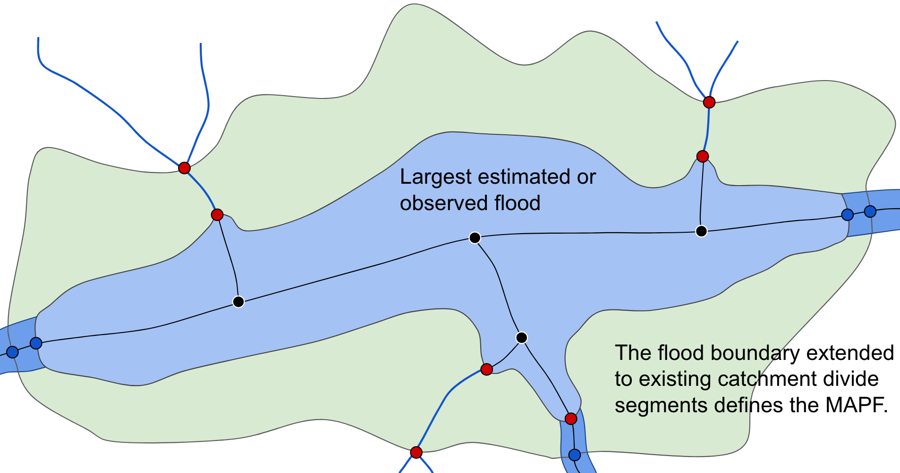

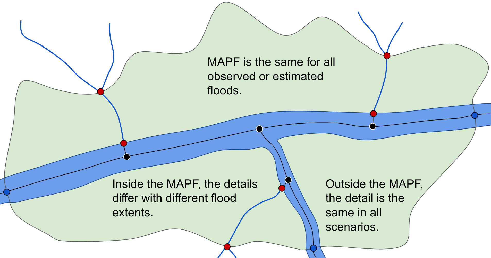

Given that the MAPFs do not overlap, this approach can support an
arbitrary number of simultaneous flood scenarios. The expression above
can be extended to the following.

> Ui1(rx1),i2(rx2),... ← {S!i1,!i2,... + Si1(rx1) + Si2(rx2) + …}

The first S in the brackets refers to the subgraph for the area outside of all APFs. The subsequent subgraphs refer to the areas
MAPFi1, MAPFi2, etc. The return periods rx1, rx2, etc. would likely all be the same, but they could be different if desired.

##### Graphs and Coalescing Waterbodies (experimental)

Another way of considering time relates to the likelihood of two nearby
waterbodies coalescing over a given time period. The figure below shows
a number of lakes in dark blue and several streams in light blue. The
red line segments show connections between nearby waterbodies. With
sufficient data or modelling results, return periods could be estimated
for each red segment, indicating the frequency of the two waterbodies
merging. The proximity network formed by the red line segments can be
represented by a graph separate from the hygraph. Using the two together
could allow for powerful analyses.

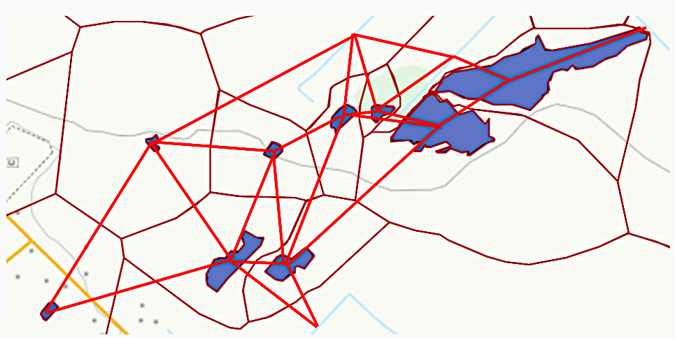

#### Location and Linear Referencing

The NHDPlus strongly supports linear referencing with meaningful codes.
It allows the determination of what is upstream or downstream from what
along a river system, without any need to interrogate the geometry. The
importance of a section of river can be inferred from coding as well.
HY\_Features describes linear referencing of positions along a river
based on a nominal main flowpath, although it does not include a main
flowpath formally in its model.

By contrast, CHyF does recognize a main flowpath but does not support
linear referencing. Two reasons exist for this omission. The first and
most important is that given the nearly instantaneous speed of graph
operations, leveraging traversal techniques through a network provides
similar if not much better performance than determining paths based on
codes. The second reason concerns maintenance. If codes are not needed,
then maintenance is significantly reduced, especially as related to
updating with its attendant conflation from old to new river segments.

With CHyF it is sufficient to provide coordinates, specified in a
coordinate reference system, for a given location of interest. That
location may refer to an event or a general position of interest along a
hydro network. The location may be on or near a flowpath; in the latter
case, a position on the flowpath can be determined by direct projection
onto the nearest point on the nearest flowpath or by calculating a
downhill path to the flowpath. Relative position and network distances
among points located along the network can be determined as described in
the following subsections.

#### Network Distances

Consider a number of points of interest in a large watershed. A network
distance can be determined from one location to another through the
network. In the figure below points p1 through p7 are depicted with
triangle icons. These may be pour points intended for hydrologic
analysis, hydrometric station locations, fish inventory sites or general
points of interest. Assume the following: p2 and p5 are snapped to the
nearest point on the nearest elementary flowpath; p6 is treated as the
outflow point for both inflowing flowpaths; and where a pour point falls
along a flowpath and not at an endpoint, the flowpath is broken there
and the corresponding elementary catchment is broken as well (as per
figure xx).

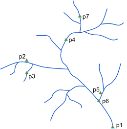

A distance matrix, di,j, can be defined, with downstream distance indicated as a positive delta (Δ) and upstream distance as a negative delta (Δ). The values below the main diagonal are equivalent to those above it, but with the sign reversed because of the difference in flow direction. The matrix could if desired be represented more compactly as a triangular matrix with no loss of information.

|From\To|p1       |p2         |p3         |p4         |p5         |p6         |p7         |
|-------|---------|-----------|-----------|-----------|-----------|-----------|-----------|
|p1|0      |-Δ(p1,p2)   |-Δ(p1,p3)         |-Δ(p1,p4)         |-Δ(p1,p5)        |-Δ(p1,p6)      |-Δ(p1,p7)      |
|p2|Δ(p2,p1)      |0   |--         |--         |--        |Δ(p2,p6)      |--      |
|p3|Δ(p3,p1)      |--   |0         |--         |--        |Δ(p3,p6)      |--      |
|p4|Δ(p4,p1)      |--   |--         |0         |--        |Δ(p4,p6)      |-Δ(p4,p7)     |
|p5|Δ(p5,p1)      |--   |--         |--         |0        |Δ(p5,p6)      |--    |
|p6|Δ(p6,p1)      |-Δ(p6,p2)   |-Δ(p6,p3)         |-Δ(p6,p4)         |-Δ(p6,p5)        |0      |-Δ(p6,p7)    |
|p7|Δ(p7,p1)      |--  |--         |Δ(p7,p4)        |--        |Δ(p7,p6)     |0    |

From this matrix it is easy to determine the complete set of paths,
assuming that the network on which the points lie is dendritic:

> 
p2 → p6 → p1

> 
> 
p3 → p6 → p1

> 
> 
p5 → p6 → p1

> 
> 
p7 → p4 → p6 → p1

Using the hygraph and spatial geometry, CHyF services can provide such
information without depending on meaningful, immutable codes.

#### Point Relationship Tree

Through observation or calculation, the data may distinguish primary
flows from secondary flows that may exist through braided channels or
around islands. Similarly, the main flowpath (i.e., the mainstem) may be
indicated as well. Horton Order (see section xx below) can also be
generated as a measure of importance for every flowpath; the higher the
Horton Order value, the more important the flowpath. In figure xx below,
Horton Order is indicated by the thickness of the line, with the
heaviest line segments corresponding to the main flowpath. Given the
primary flowpaths, Horton Order values for each flowpath, and the
hygraph, a Point Relationship Tree can be generated of the order of the
points, from downstream to upstream.

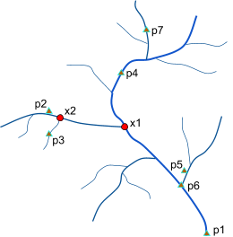

The same locational assumptions about the pour points described in the
previous section apply here.

Consider just p6 and its upstream neighbour p5, a tree can be defined as
p6(p5). The round brackets contain between them what can be traversed
upstream from the element appearing before the brackets.

Next consider just points p2, p3 and p4. The tree would be
x1(x2(p3,p2),p4). x2 is introduced as it represents the confluence of
the branches that correspond to p3 and p2. Traversal from either p3 or
p2 to x2 is possible, so p3 and p2 are in brackets preceded by x2. Since
p3 and p2 do not have a traversal relationship, brackets are not used
between them. p3 precedes p2 because the branch on which it resides is
of less importance. x2 precedes p4 for the same reason, its
corresponding flowpath is of less importance. x1 is introduced as the
confluence of the branch associated with x2 and the branch associated
with p4.

Now the entire Point Relationship Tree can be constructed. Following the
same logic, the expression on the left below results. The two confluence
x1 and x2 are additional points unspecified by the user. They are
present to support the branching in the tree. The tree can also be
represented as a schematic as shown on the right, which makes it easier
to understand. The upstream approach taken here to defining the tree is
sometimes referred to as *depth first* traversal, as the (upstream)
children of each node in the tree are listed before the node’s siblings.

> Expression:
> 
> p1(p6(p5,x1(x2(p3,p2),p4(p7))))
> 
> Schematic:

>| |    |    |    |    |
>|-|:--:|:--:|:--:|:--:|
>| |p3  |    |p2  |p7  |
>| |↘   |    |↙   |↓   |
>| |    |x2  |    |p4  |
>| |    |↘   |    |↙   |
>| |p5  |    |x1  |    |
>| |↘   |    |↙   |    |
>| |    |p6  |    |    |
>| |    |↓   |    |    |
>| |    |p1  |    |    |

One important difference between the schematic and the actual geography
is that with the schematic adjacent points at any one level of the tree
are located on flowpaths of increasing order of importance from left to
right. p2 is to the right of p3 because its corresponding flowpath has a
higher Horton Order value compared to that for p2. Such relationships
are not necessarily the case with the geography; p5 for example is on
the left side of the schematic but on the right side in the real world.

So long as the network on which the points are located is dendritic, a
Point Relationship Tree can always be generated, which shows the
downstream relationships and the branching structure. Reading from right
to left it is also possible to generate the paths noted earlier under
the network distance matrix: p7→p4→p6→p1, p2→p6→p1, p3→p6→p1, and
p5→p6→p1.

#### Order

Various ways of defining stream order have been developed. These all
depend on a dendritic network that can be generated by either ignoring
secondary flows or modifying their geometry such that a dendritic
pattern results. Currently CHyF supports the first technique, but the
second may be implemented as a service if warranted. It is of interest
that for some applications a user may require that the network be
topologically dendritic. This is the case for example for those wishing
to convert the data to a raster form with the intent of using an
eight-direction (D8) flow model to create flow direction and
accumulation grids.

The most common stream ordering system is that defined by Arthur
Strahler. Shown in the left-hand diagram below (after Wikipedia), it is
often referred to simply as stream order. Robert Horton is responsible
for a related ordering system, as shown on the middle diagram. Strahler
order is readily determined moving from the headwater flowpath segments
downstream. Horton order can then be derived moving in the opposite
direction, as described later. John Hack developed another ordering
scheme, which is similar to Horton order, but beginning at the outlet
and moving upstream. It is sometimes referred as stream level. A useful
artifact of determining Horton or Hack order is the definition of the
main flowpath (mainstem), shown in red on the middle and right-hand
diagrams. CHyF supports these three kinds of stream ordering, all of
which can be algorithmically generated, so long as primary flows are
designated.

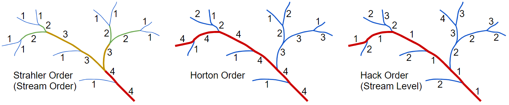

*Figure xx: Stream order systems*

Once either Horton or Hack Order is defined, the mainstem upstream from
*any* arbitrary location on the network is defined. Horton order has
been used to support generalization. For example in Figure xx, flowpaths
could be removed with a Horton order of 1 or 2, and all others could be
retained. The result would be a much simpler stream network that would
also have much simpler catchments. The geometry of both the resulting
network and the catchments could be simplified further through suitable
algorithms (such as Douglas-Peucker) if desired. (Other approaches to
generalization exist, but this one can be easily implemented.) Hack
order has the property that order number is relatively invariant under
different degrees of generalization. For example, a stream emptying into
the ocean will always be of order 1, and branches that remain after
pruning based on Horton Order, will have the same Hack Order as they did
before pruning.

The determination of both Horton Order and Hack Order requires moving
upstream following the most important stream at each confluence.
Importance can be defined by: (i) name, (ii) actual flow, (iii) flow
accumulation as indicated by area, (iv) length, or (v) number of
inflowing tributaries. Good arguments exist for all of these. Name is
often correlated with average flow magnitude, but flow data may be
available or may be estimated. Length is simple to measure and often is
roughly related to relative flow volume. With CHyF, name, flow volume
and total upstream network length, in that order, will be used as the
default basis for such ordering. Calculation details for Strahler Order,
Horton Order and Hack Order are provided in Appendix xx.

Other ordering systems may be of interest. For example, Shreve Order
provides the number of upstream unary nexuses (equivalent to the number
of first order streams) for a given stream segment. The [Pfafstetter Coding
System](https://en.wikipedia.org/wiki/Pfafstetter_Coding_System)
embeds topologic relationships in the codes for each flowpath segment
and corresponding primary catchment. CHyF does not support these, but
they could be added as services if there were sufficient interest.

#### Scale (experimental)

Feature representation is typically related to scale. Of relevance here
concerns the geometry used to represent hydro features at various
scales. A catchment, reservoir or lake will always have a surface
representation as a polygon. Hydro locations such as dams may have the
geometry of a point, linestring, or polygon, depending upon scale and
purpose. A small river is considered a linear feature and is represented
by a sequence of linestrings; however, at a larger scale the same river
may have polygonal geometry.

CHyF represents the area on either side of a single-line river as part
of the same catchment, as shown on the left side of the figure below,
and in the various figures above. This is similar to how a reach
catchment is defined in the NHDPlus. If instead a double-line
(polygonal) representation is used for the river, a separate catchment
would be defined on each side of the river (as shown in Figure xx).
However, CHyF could be extended to represent each side of a single-line
river as a separate elementary catchment, as shown on the right side of
the figure below.

One argument for doing so is to make the results somewhat scale
independent. However, as scale varies so typically does the level of
detail in both the numbers of rivers and their respective geometric
representations; the elementary catchments will vary as a function of
both of these factors.

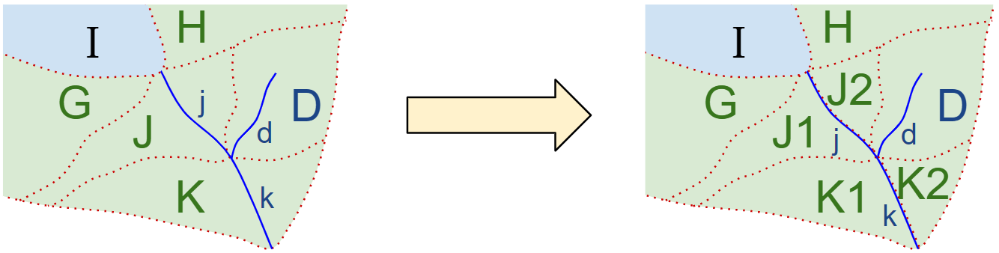

CHyF’s underlying model is not scale dependent, since: (i), the
modelling constructs apply at any scale, (ii), they can be represented
directly in a graph at any scale, (iii), the graph at one scale can be
related to the graph at another scale, and (iv) different geometries may
be applied at the same or different scales (as noted above). That does
not mean though that scale is not an issue, especially as lidar and
other high resolution raw data sources are used more and more not only
to define an elevation surface, but also as the basis for extracting
hydro features. The core issue with CHyF is to ensure that the
catchments, waterbodies, and flowpaths have correct topological
relationships such that Directed Acyclic Graph structures can be
generated. So long as this condition is met, CHyF is suitable for data
at widely ranging scales.

### Classes and Relationships

In the subsections that follow, a series of UML diagrams are provided.
Within each diagram the classes that correspond to a class in
HY\_Feature are depicted with a black boundary. A red boundary means
that the class represents a newly introduced construct. For example, in
the diagram under Hydrologic Features below, CA\_Catchment is considered
as equivalent to HY\_Catchment from HY\_Features, whereas
*CA\_ElementaryCatchment*, CA\_Wetland, *CA\_IceSnow*, CA\_Snowfield,
and CA\_Glacier are all introduced.

Another convention used here concerns the text style. If it is in
italics, the class is an abstract superclass, which means that it is
never instantiated directly; instead, instances may be defined of its
subclasses. *CA\_ElementaryCatchment, CA\_Waterbody* and *CA\_IceSnow*
are all examples of this. So CA\_Glacier and CA\_Snowfield may be
instantiated directly, but *CA\_IceSnow* cannot.

The UML diagrams emphasize class hierarchies and general relationships.
Details about constraints are not included in the UML; instead they are
enunciated as topological rules in a subsequent section. Additional
geographic figures are provided to help convey details not provided
previously. The same graphical conventions are used here as well.

#### Hydrologic Features

Hydrologic (or hydro) features consist of water features (waterbodies),
containers for water (depressions), and specific areas of the terrain
conceptualized as draining into flowpaths (catchments), as shown in in
figure xx below. Also included are wetlands, glaciers and snowfields, as
described later.

Although these concepts are all distinct, geographically overlaps exist.
These details are not included in the UML. A depression may or may not
contain a waterbody. A depression in its entirety or in part may also be
considered a catchment. Catchments may be entirely terrestrially based,
they may contain a stream, or they may be waterbodies or portions of
waterbodies.

In general a hydrologic feature flows into another hydrologic feature,
through a hydro nexus. A catchment flows into another catchment, a
waterbody flows into another waterbody, and a depression (including the
notion of channel) may be connected to another depression. However,
these flows are not constrained to the same type of hydro feature. For
example, a channel may flow into a river, which may flow into a
catchment. Many other combinations are also possible.

Hydro features may be named.

##### Waterbodies and Depressions

The term waterbody applies to any body of water, whether it is actively
moving or largely static. Thus rivers, lakes and estuaries are
considered as types of waterbodies, as are subsurface contained flows,
near shore zones, and oceans. In common parlance the terms rivers,
streams, and creeks are frequently used. In HY\_Features and CHyF they
are considered together under the class HY\_River and CA\_River,
respectively. Similarly, ponds are grouped with lakes under HY\_Lake and
CA\_Lake. The class *subsurface contained flow* is included in CHyF so
that connectivity between surface features and within urban landscapes
can be modelled effectively. The most significant feature in this class
is storm drain, although controlled flows through large dams are also of
major interest.

Great lakes are large lakes and include the Great Lakes of North America
and other lakes of notable size. The class is recognized in CHyF as a
specialization of lake, since different kinds of hydrologic models may
be applied to them, compared to more typically sized lakes. Wastewater
ponds are included as a type of lake in the CHyF model because of their
constraints and because they are often mapped separately from lakes.
Nearshore zones represent the zones along the shorelines of estuaries,
oceans, large lakes, and wide rivers. This class is introduced into CHyF
because it helps resolve problems with how to include large waterbodies
in hydrologic networks. Reservoirs are not considered as a type of
hydrologic feature. Instead, a reservoir is treated as a control
structure to which a hydro feature has a relationship.

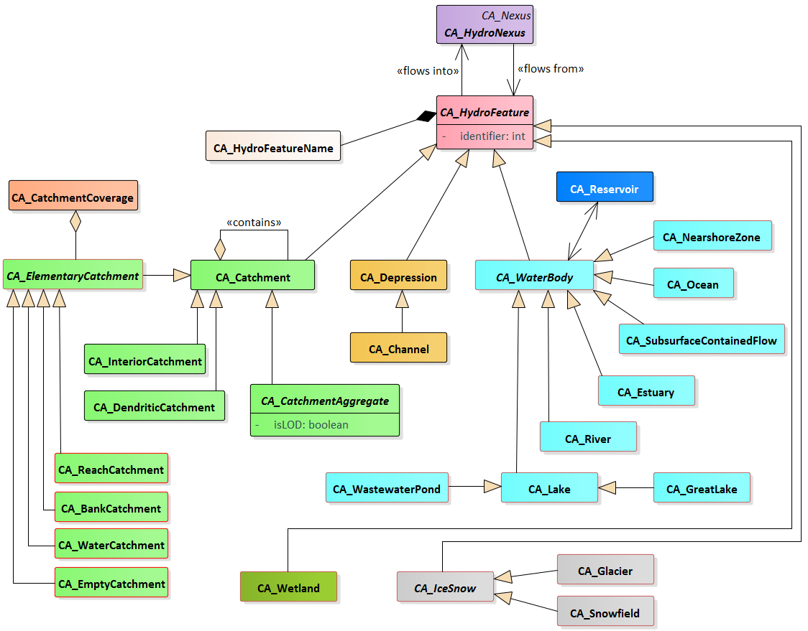

Waterbodies sit in depressions in the land. Depressions may exist
without being filled with water most of the time. Water may accumulate
in them ephemerally during and immediately after major storms, depending
upon the terrain, surficial material, weather and other factors. An
elongated depression that contains or potentially could contain a river
is a channel. Lidar and other high-resolution sources of elevation data
may serve as the basis for depression and channel extraction.
Unconnected features my come out of such extraction efforts; with CHyF
they can remain unconnected, or alternatively, connections can be made
to one another and to nearby waterbodies.

##### Glaciers, Snowfields and Wetlands

Other types of hydro features are included in CHyF because of their
general importance. More than two-thirds of the world’s freshwater is
estimated to be held in ice and snow \[USGS\]. Glaciers and snowfields
represent important sources of water in many areas of the world and are
also of consequence in the context of climate change. CHyF includes them
as hydro features. Also included are wetlands, which hold considerable
water globally and are of high significance to floodwater retention,
biodiversity, aquaculture, carbon cycling and climate change.

##### Catchments

Precipitation falls indiscriminately on land and water. Like NHDPlus,
CHyF explicitly states that it always fall on a catchment, an area that
can be modelled as draining to a common outlet point. A catchment may be
of continental scale, such as the catchments for the Saint Lawrence
River or the Mississippi River, or may by very small, such as those for
unnamed creeks. At the most detailed level, CHyF recognizes an
elementary catchment. As described elsewhere, in CHyF each elementary
catchment may contain an area of land or an area of water, but not both
areas of land and water. This is in contrast to the NHDPlus, which does
not recognize water catchments and consequently includes arbitrary
sections of lakes, wide rivers and estuaries in the delineation of
catchments along shorelines. HY\_Features does not give guidance as to
what may be contained in a given catchment, so either approach can be
said to be compliant with HY\_Features’s conceptual model.

Elementary catchments in CHyF form a coverage such that they completely
cover the land and waterscape with no gaps and no overlaps. This
catchment coverage in an intrinsic part of the CHyF model as it relates
directly to the hygraph and some of the CHyF services. HY\_Features
discusses the general idea of a coverage composed of catchments,
although it does not include it within the normative part of the
document.

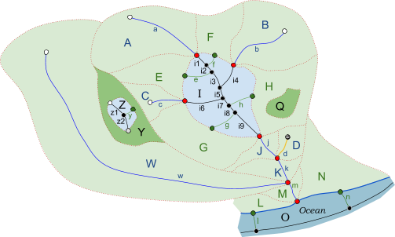

CHyF recognizes four kinds of elementary catchments: reach catchments,
bank catchments, water catchments, and empty catchments. In figure xx
above, A, B, C, D, J, K, W and M are reach catchments. They each contain
a single-line river segment. The elementary catchments E, F, G, H, and Y
are referred to as bank catchments, since they drain directly into
adjacent waterbodies with areal extent, which in these cases, are
neighbouring lakes. L and N are also bank catchments, draining into the
ocean. The two lakes, I and Z, and the ocean, O, are elementary
catchments that are referred to as water catchments. Elementary
catchment Q is an empty catchment, as it does not contain nor is it
adjacent to any waterbodies.

One property of a catchment is that it may contain other catchments that
in turn may include still other catchments. This recursive nature of
catchments stops at elementary catchments. However, the container
structure is not necessarily completely hierarchical. A large catchment
may for example be broken down into an upper catchment and a lower
catchment. As another example, an interior catchment, such as Y-Z or Q
in the figure above, may be included with adjacent catchments, even
though a flow relationship between them does not explicitly exist.

An interior catchment may be very small, as with a depression in the
terrain containing no water (an empty catchment). Alternatively, an
interior catchment may contain a complex network of smaller catchments,
that ultimately do not drain to the ocean. The Great Basin in the United
States is an excellent example of a very large interior catchment. An
interior catchment may be composed of other interior catchments.
Consider the simple case of two nearby isolated lakes. The ring of land
around each lake in combination with the surrounded lake forms an
interior catchment, and the two resulting adjacent interior catchments
can be considered together to form a single interior catchment. This is
shown in the map snippet below from the Richelieu Valley in Quebec,
where five interior catchments combine to form two, larger interior
catchments.

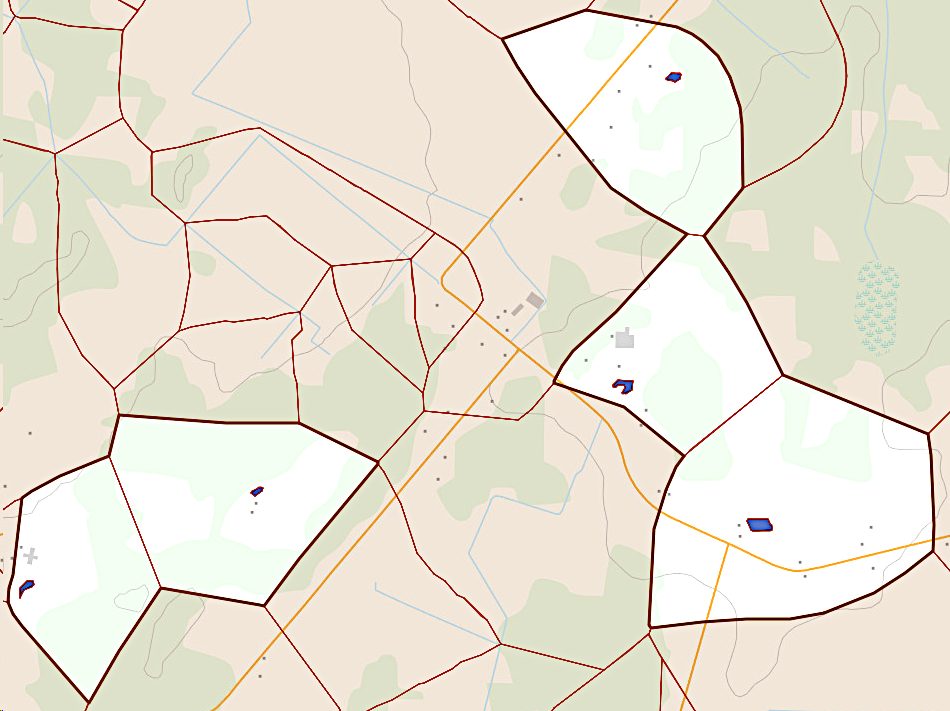

Interior catchments are referred to as endorheic, as opposed to exorheic
catchments, which drain externally. In many locals, small lakes may
exist with no visible outlets; they and their immediate drainage areas
constitute interior catchments. They can be allocated to larger,
adjacent catchments if desired, based on proximity of the interior
waterbodies to outside waterbodies that are part of exorheic catchments.
So for example in the example above, depending upon the specific
location of nearby waterbodies (not shown), all five interior catchments
may be assigned to the same major, externally drained catchment, or
alternatively, some could be assigned to one such catchment and others
to another, depending entirely on proximity.

CHyF recognizes dendritic catchments as a class, CA\_DendriticCatchment,
as is also true with HY\_Features, using HY\_DendriticCatchment. A
catchment is considered as dendritic if it contains a corresponding
flowpath network that is dendritic. Because secondary flowpaths are
common, through braided stream systems, around islands, and on deltas
for example, such a pattern may still be considered as dendritic so long
as flowpaths are demarcated as either primary or secondary. In CHyF
dendritic is then taken as meaning that the primary flowpaths are
identified and that they form a tree-like structure. Dendritic
catchments are important because of their relationship to catchment
aggregates (see below) and because they can help establish
interoperability with data adhering to other models.

HY\_Features introduces the very useful concept of a catchment
aggregate, an aggregation of one or more dendritic catchments with
associated interior catchments. CHyF has the class
CA\_CatchmentAggregate, defined as an abstract superclass. The intent is
to treat large catchments in hierarchical systems as catchment
aggregates. The areas defined by the Water Survey of Canada
Sub-Sub-Drainage network or the HUC12 watersheds in the NHDPlus are
practical examples of catchment aggregates. More generally, this
supports communication about for example the catchments defining the
lower Fraser River or the upper Colorado River.

#### Catchment Realizations

HY\_Features introduces the notion that catchments can be realized by
other features, with catchment boundaries and flowpaths being examples
that are included in CHyF. This has the interesting effect that, even
though catchments are hydro features, their boundaries and associated
flowpaths are not. This dichotomy is conceptually useful as divides and
flowpaths exist only as a function of the existence of catchments; as
well, they can both be algorithmically defined based on general notions
of flow in and through catchments.

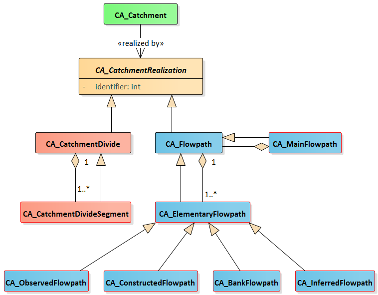

##### Catchment Divides and Catchment Divide Segments

The figure below is equivalent to figure xx above, but with only the
catchments and their boundaries showing. The endpoints of the bounding
segments are indicated with an **x**. These bounding segments in CHyF
are referred to as catchment divide segments that can be assembled to
form catchment divides, which also exist in HY\_Features. A catchment
divide is any arbitrary path through the catchment divide segments,
including but not restricted to the complete boundary of any given
catchment. The catchment divide segments are comparable to elementary
flowpaths, with particular paths through them of hydrologic
significance.

CHyF recognizes two approaches to the creation of catchment divide
segments. The first involves the generation of boundaries approximating
the medial axis between waterbody features, ignoring elevation data.
This places the divides halfway between nearby waterbodies that may have
either linear or polygonal geometries. This is appropriate on flat
terrain where the elevation surface may not have sufficient resolution
to indicate accurately the direction of overland flow. It may also be
used where suitable elevation data is not available. The second approach
takes elevation into account, such that flow direction and thus the
position of the divide is consistent with downhill flow over the
surface. This is required in areas of noticeable relief. A combination
of these two approaches is also possible.

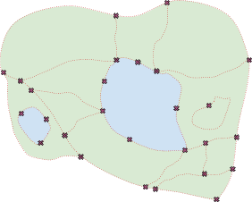

##### Flowpaths and Elementary Flowpaths

A flowpath is a theoretical construct representing the flow of water on
the terrain. Geometrically, a flowpath is either a single elementary
flowpath or a sequence of elementary flowpaths, all with a consistent
direction. An elementary flowpath is a section of a flowpath bounded by
a nexus (e.g., a confluence or a head water start point) at either end
and with no intermediary nexuses. The elementary flowpaths form a
directed acyclic network; consequently, no loops exist where water flows
from an elementary flowpath and ultimately returns to it. In the case of
a single-line river, the geometry of an elementary flowpath is
equivalent to a segment of the river. In the case of any waterbodies
with polygonal geometry, elementary flowpaths exists as part of a
flowpath skeleton in the waterbody. These skeletal elements do not
contribute to the delineation of catchments, so the number and exact
locations of such elements are generally not important.

CHyF specifies four classes of elementary flowpath. Observed flowpaths
(in blue) are geometrically equivalent to single-line rivers segments
and thus are considered to be directly observed. Constructed flowpaths
(in orange) are elementary flowpaths that are assumed to be present in
the given location, but are not directly observed. The one example in
the figure (flowpath d) connects a spring to the nearby river, following
the path of steepest descent over the elevation surface. Bank flowpaths
(in green) are elementary flowpaths that connect a bank catchment
(without a contained stream) to the flowpath skeleton in an adjacent
waterbody. They are of note topologically because each intersects its
corresponding catchment only at its start point. Inferred flowpaths (in
black) are elementary flowpaths added to create connectivity through
polygonal waterbodies. Their respective positions are somewhat
arbitrary, as is even true of how they are connected within the
respective waterbodies.

Figure xx below shows the relationships between elementary catchments
and both elementary flowpaths and catchment divide segments. The centre
part of the diagram shows that elementary flowpaths act to drain
elementary catchments, with the details dependent on the flowpath and
catchment types. Every reach catchment is drained by either an observed
or constructed flowpath. Every bank catchment is drained by a bank
flowpath. Water catchments are also considered to be drained by
potentially many bank catchments, as well as by potentially many
inferred flowpaths. Empty catchments do not have a relationship to
elementary flowpaths, since they do not contain and are not adjacent to
surface water.

The figure above also shows that every elementary catchment is bounded
by a catchment divide; that is, the boundary of the elementary catchment
defines a catchment divide. Other catchment divides may be specified,
but their constituent segments will also be part of the boundary of
local elementary
catchments.

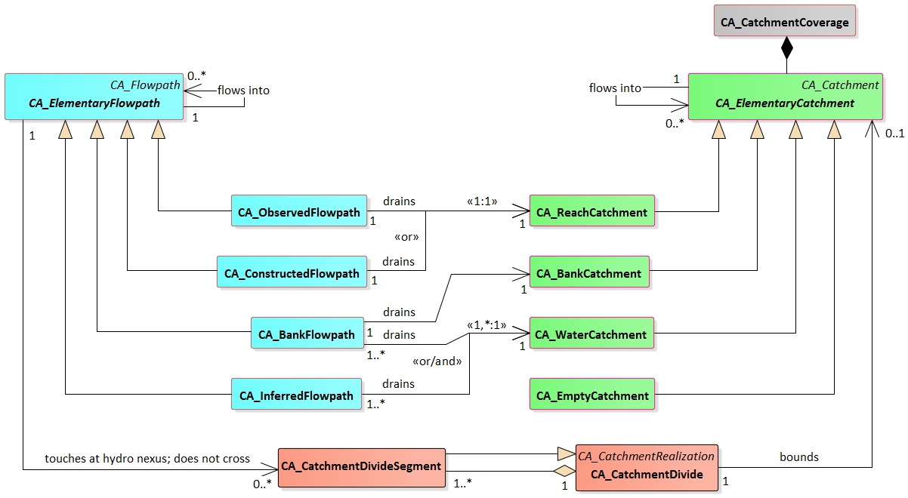

#### Hydro Nodes and Hydro Nexuses

CHyF recognizes different kinds of hydro nodes in a three level
hierarchy (figure xx below). A hydro end node is characterized by having
only a single associated flowpath. Its node representation in a graph
always has a valence of exactly one. A hydro end node has an attribute,
onAOIBoundary, that has a value of True if the hydro end node is on the
boundary of the area of interest, i.e., the area under consideration.
This may happen especially if the area of interest is specified as a
bounding box or some other area without hydrological significance. In
the more typical case, onAOIBoundary has a value of False, which is the
default.

Two types of hydro end nodes exist, headwater nodes and terminal nodes,
which are rendered as white dots and gray dots, respectively, in the
previous figures. Terminal nodes are found in two distinct situations.
The first case is shown in figure xx above, where the endpoint of a
flowpath represents the end of a flowpath network in an interior
catchment. In the second case, the terminal node lies on the boundary of
the area under consideration, as described above. A headwater node may
correspond to a spring, or more generally, the starting (upstream) point
on a single-line, headwater stream. However, it may also exist on a
boundary, like a terminal node.

An inferred junction occurs within a waterbody with polygonal geometry.
It connects skeletal elements, including inferred flowpaths and bank
flowpaths, and consequently it always has a valence greater than one.

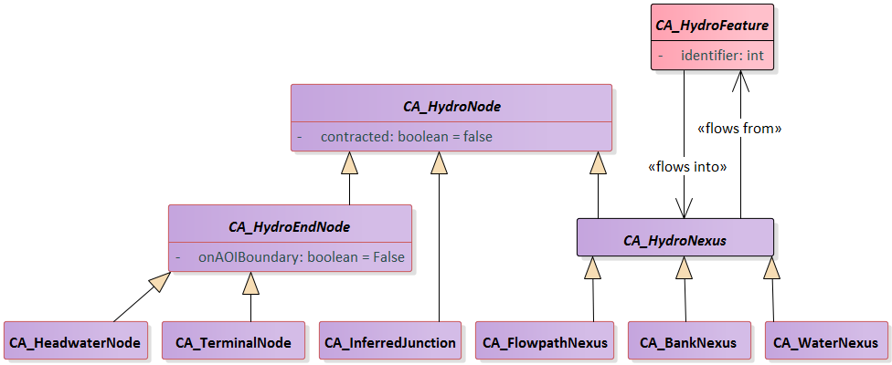

A hydro nexus acts as an interface between hydro features of the same or
different types. Three classes of hydro nexus are recognized. A flowpath
nexus always serves as the outflow of a reach catchment and the inflow
of the immediate downstream catchment. A bank nexus is a proxy for the
shoreline of a bank catchment; it is represented as a point located on
the land-water boundary and it serves as the upstream endpoint of a bank
flowpath. A water nexus exists on the boundary of two water catchments.
If a river or nearshore zone, for example, is subdivided into multiple
catchments (figures xx and yy), or if a boundary is placed in the water
between a lake and a wide (double line) river (figure zz), then a water
nexus exists along that bounding segment. An inferred flowpath flows
into a given water nexus, and another inferred flowpath flows out of it.

Shown in figure xx below are the relationships among the four types of
elementary catchments, the four types of elementary flowpaths, and the
six instantiable types of nexuses. Like those displayed above in figure
yy, these relationships can contribute to a set of topological rules
that can be applied to test data integrity (see section xx).

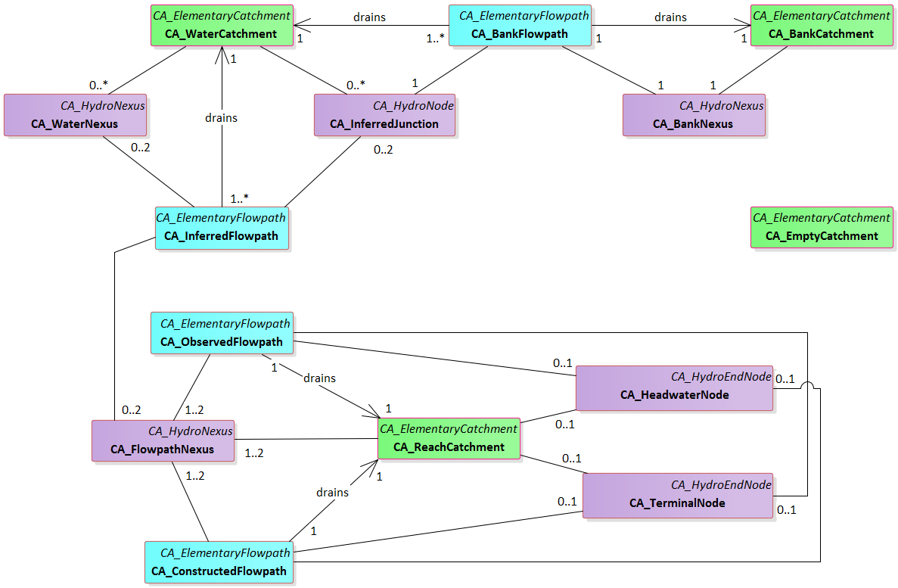

#### Hydro Locations

Hydro locations are located along flowpaths and are represented as
points that can be projected onto a flowpath. The projection may be to a
flowpath endpoint, a nexus, or to an arbitrary point along the flowpath.
In the latter case, the nearest point along the nearest elementary
flowpath would be the default, although the projection could follow the
path of steepest descent until intersecting with a flowpath.

A set of hydro location types has been defined, as shown in the
enumerated list on the right side of figure xx below. With the exception
of arbitrary location, the types all come from HY\_Features, and with
the second exception of pour point, also from the International Glossary
of Hydrology. These ten terms have been retained, whereas others have
been dropped because of either redundancy or lack of use.

Arbitrary location has been introduced to satisfy the requirement for a
general hydro location, with an unassigned type.

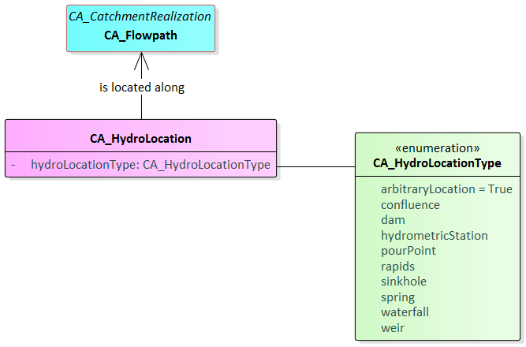

#### Hydro Networks

CHyF recognizes five types of hydro networks (figure xx). Following
HY\_Features, it includes hydrographic networks containing waterbodies
(including instances of rivers, lakes, estuaries, etc.), catchment
networks containing catchments, and channel networks containing
depressions (including instances of the subclass channel).

CHyF also includes flowpath networks containing flowpaths, and catchment
divide networks, containing catchment divides. Flowpath networks are
discussed in HY\_Features but are not part of the formal specification.
Flowpath networks and catchment networks are embedded in the notion of
the hygraph, so they are of fundamental importance to CHyF.

Catchment divide networks are introduced because they provide a means of
navigating catchment divides independent of flowpaths and catchments.
This can be useful in the context of certain services and applications.

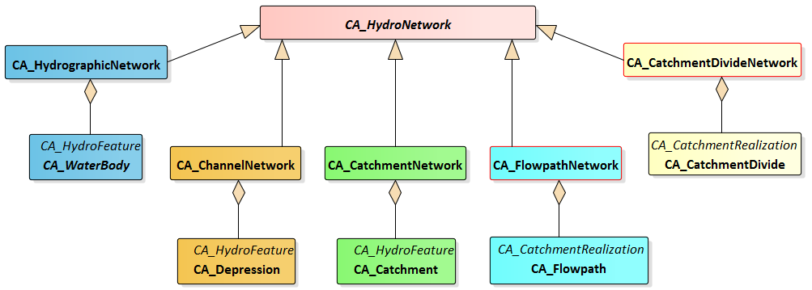

### Topological Rules

The rules are based on the topological relationships between features
and can be expressed using the Dimensionally Extended nine-Intersection
Model [(DE-9IM)](https://en.wikipedia.org/wiki/DE-9IM),
which is recognized by the OGC Simple Feature Access specification. The
term *contained by* is introduced; if x *contains* y then y is
*contained by* x. The other term for *contained by* is *within*. This
latter term is avoided here because *within* may be equated with
*inside*, which may have slightly different semantics depending upon
use.

#### Elementary Feature Rules

The following rules apply to the topological relationships between
elementary catchments and elementary flowpaths.

The following types of elementary catchments (LC) exist:

1. ReachCatchment (RC)

2. WaterCatchment (WC)

3. BankCatchment (BC)

4. EmptyCatchment (EC)

In all cases they are represented geometrically as polygons, with an
interior area and a boundary consisting of one outer ring and zero or
more inner rings.

The following types of elementary flowpaths (LF) exist:

1. ObservedFlowpath (OF)

2. ConstructedFlowpath (CF)

3. InferredFlowpath (IF)

4. BankFlowpath (BF)

In all cases they are represented geometrically as linestrings, with an
open-ended line as the interior of a line string and a boundary
consisting of two endpoints.

The rules between these elementary features are as follows:

1. Every OF is *contained by* an RC.

2. Every CF is *contained by* an RC.

3. Every RC *contains* one and only one LF, which may be of type OF or CF.

4. For every RC, its boundary *intersects* the boundary of an LF at either one or both endpoints.

5. Every BC does **not** *contain* an LF.

6. Every BC *touches* one and only one BF.

7. Every BF is *contained by* one and only one WC.

8. Every IF is *contained by* one and only one WC.

9. Every WC *contains* one or more IF.

10. Every EC is *disjoint* from all LF

11. Every EC is *disjoint* from all other LC.

12. Every LF does **not** *cross* any other LF.

13. The interior of every LF does **not** *touch* the boundary of an LC.

14. An endpoint of every LF does **not** *touch* the other endpoint of the LF.

15. Every BC *touches* one or more WC and the intersection of each such BC – WC pair is a linestring.

16. All LC form a continuous coverage with no gaps and no overlaps, and with matching vertices along the boundaries of adjacent LC.

Rules for LF endpoints could be defined, but there is no reason to do
so. If the rules above are all validated, so would rules about the
endpoints.

#### Higher Level Feature Rules

An additional set of rules applies to features that typically are
composed of a number of elementary features. These include catchments
covering more than an individual elementary catchment and also including
catchment aggregates, dendritic catchments, and interior catchments.
Arbitrary flowpaths, main flowpaths and and the various kinds of hydro
networks are other higher level features of interest here.

The three most important rules are as follows:

1. Every Nexus which is not a terminal point must have at least 1 outflowing flowpath

2. Every Nexus which is not a headwater point or bank nexus must have at least 1 inflowing flowpath.

3. An arbitrary flowpath through a flowpath network must never form a cycle, whereby flow from a flowpath endpoint ultimately flows back into the same flowpath endpoint through the flowpath network.

Additional rules of interest, that do not necessarily need to be
validated, are listed here:

1. Every catchment network *contains* a corresponding flowpath network.

2. In areas where waterbodies are all represented geometrically by linestrings, and where empty catchments do not exist, a one-to-one relationship exists between elementary catchments and corresponding elementary flowpaths.

3. In areas where one or more waterbodies are represented geometrically by polygons, or where empty catchments exist, a one-to-one relationship does not exist between elementary catchments and elementary flowpaths.

4. Every dendritic catchment contains a dendritic flowpath network formed by elementary flowpaths that are attributed as primary flows.

5. Every catchment aggregate is composed of catchments that form a coverage that *covers* the area of the catchment aggregate.

### Feature Collection, Feature Identity and Linked Data

A feature collection in CHyF consists of a collection of objects
conforming to the CHyF model. The objects can belong to any of the
classes described in the next section below. In practice, they are
likely to be hydro features, catchment realizations or hydro locations
that are found in a given area or that form the response to a given
query or request over the web.

All features within CHyF have a feature identifier that is required to
define their respective relationships. These identifiers are software
assigned when the data is first read. They are not considered as
persistent, immutable identifiers that must be maintained through update
cycles for example.

The CHyF model recognizes two separate cases where a persistent
identifier is usually required. The first and more common involves
catchment aggregates, which may be referenced by different agencies or
included in linked data relations. The second case relates to contracted
nexuses; these also may be used in interoperability operations.

Xxx

## Implementation

The CHyF Data Processing Tools are used to transform geospatial
hydrographic and DEM data into flowpaths and catchments that can be used
as the basis of CHyF web services. As shown in Figure 1, the source data
is assumed to be well structured. It is then processed through various
tools to create CHyF compliant input data designed to be used as the
data framework for CHyF web services. If the CHyF Data Processing Tools
are not used, then similar functionality must be available using other
techniques or the data must already contain the input data structures.

The input involves three datasets, linear waterbodies, polygonal
waterbodies and a Digital Elevation Model. The linear waterbodies
include single-line rivers, canals and subsurface contained flows with
linear geometry. The polygonal waterbodies include double-line rivers,
lakes, estuaries, nearshore zones, and the ocean. The DEM may consist of
either a gridded elevation dataset in a raster structure or a set of
elevation points as a point cloud.

Ideally the waterbody features and the DEM were derived as part of the
same mapping process, such that the features and the elevation data are
consistent with one another. If this is not the case, then discrepancies
between them must be addressed specifically in the catchment generation
process.

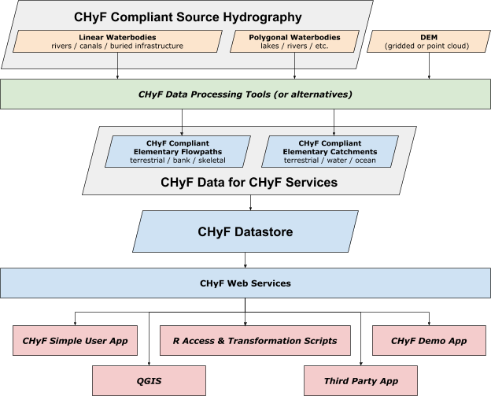

*Figure xx: Overview of CHyF compliant data creation and its use*

As depicted in Figure xx, the CHyF compliant flowpaths and catchments
are stored in a datastore of some kind. Files, a database, and in-memory
representation are all possible. The web services consume data from the
datastore to meet the various requests made by applications, scripts,
and potentially other services.

## Annex A

## Annex B